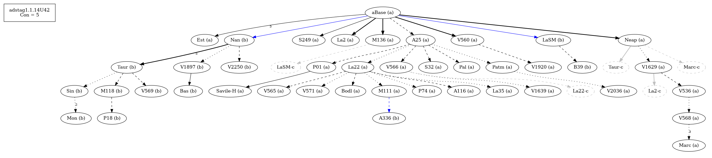
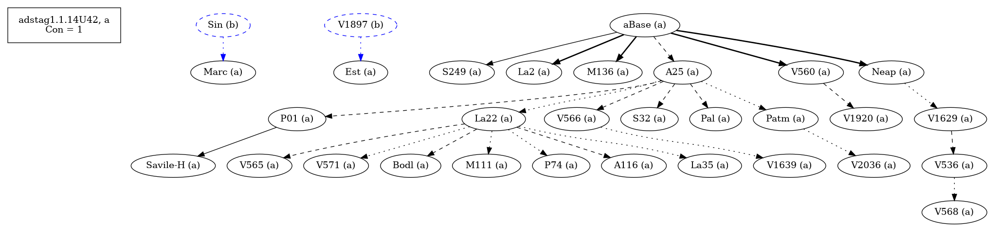
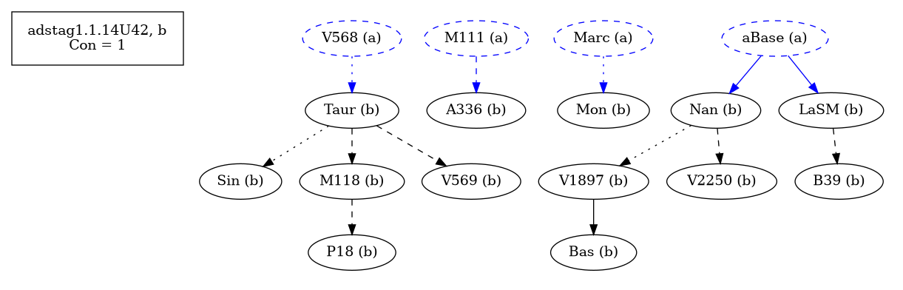

# Variant Analysis: AdStag1.1.14/42

## 📌 Variant Description
- **Location**: adstag1.1.14/42
- **Variant Units**: 
  - Reading A: τοιοῦτο
  - Reading B: τι τοιοῦτο
  

## 🧬 Manuscript Support
| Reading | Manuscripts | Notes |
|--------|-------------|-------|
| A  | P74 Pal A25 La35 La2 Patm S249 V1639 P01 V565 V560 S32 M136 Neap A116 V1920 V2036 M111 V566 V568 V536 Bodl V571 V1629 Est Marc La22 | Most, editions |
| B      | P18 V1897 V2250 Bas LaSM M118 Sin A336 La2-c1 Nan Mon V569 B39 Taur  | Bas, Nan Taur-group |

## 🧠 Internal Evidence
- **Transcriptional Probability**: 
- **Stylistic/Contextual Fit**: 

## 🧭 open-cbgm
- **Textual flow**: connectivity 1

- **Attestations**

- **Rb**

## 🔄 Directionality & Genealogy
- **Likely Original Reading**: [e.g., Reading A]
- **Genealogical Relationships**:
  - [e.g., B likely derived from A via harmonization]
  - [e.g., C appears to be a conflation of A and B]

## 🌿 Local Stemma Placement
- **Proposed Stemma**:
  - [Diagram or description, e.g., A → B → C]
- **Contamination Notes**: [e.g., Manuscript F shows mixture of A and B]

## 📝 Notes & Decisions
- [Any additional observations, uncertainties, or decisions made]

---