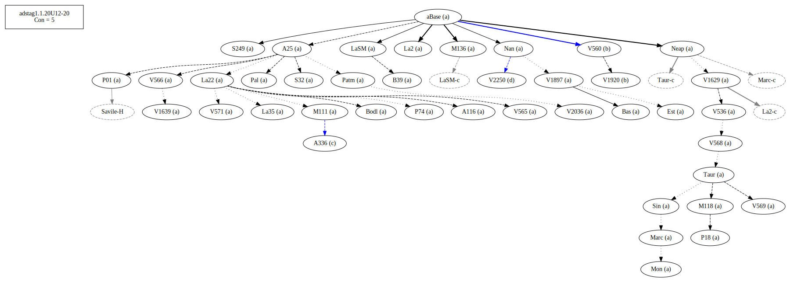
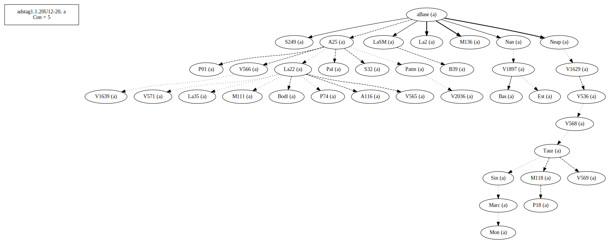
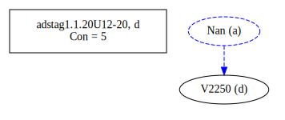

# Variant Analysis: AdStag1.1.20/12-20

## 📌 Variant Description
- **Location**: adstag1.1.20/12-20
- **Variant Units**: 
  - Reading A: δυνηθῆναι τὴν μητέρα καὶ συγκαλύψαι
  - Reading B: δυνθῆναι τὴν μητέρα συγκαλύψαι
  - Reading C: καὶ δυνηθῆναι τὴν μητέρα συγκαλύψαι
  - Reading D: καὶ δυνηθῆναι συγκαλύψαι τὴν μητέρα καὶ

## 🧬 Manuscript Support
| Reading | Manuscripts | Notes |
|--------|-------------|-------|
| A      | A116 A25 B39 Bas Bodl Est La2 La22 La35 LaSM M111 M118 M136 Marc Mon Nan Neap P01 P18 P74 Pal Patm S249 S32 Sin Taur V1629 V1897 V2036 V536 V565 V566 V568 V569 V571 | Wide range + editions |
| B      | V1920 V560    | V560 pair |
| C      | A336 | lone |
| D      | V2250  | lone |

## 🧠 Internal Evidence
- **Transcriptional Probability**: [e.g., Reading A is shorter and more difficult]
- **Stylistic/Contextual Fit**: [e.g., Reading B aligns with second sophistic style]

## 🧭 External Evidence
- **Manuscript Age**: [e.g., Reading A supported by earlier MSS]
- **Geographical Spread**: []

## 🔄 Directionality & Genealogy
- **Likely Original Reading**: [e.g., Reading A]
- **Genealogical Relationships**:
  - [e.g., B likely derived from A via harmonization]
  - [e.g., C appears to be a conflation of A and B]
- **Textual flow**:

- **Coherence of variants (readings)**

## 🌿 Local Stemma Placement
- **Proposed Stemma**:
  - [Diagram or description, e.g., A → B → C]
- **Contamination Notes**: [e.g., Manuscript F shows mixture of A and B]

## 📝 Notes & Decisions
- The construction was not immediately understood (position 18 and 26) "καὶ ... καὶ" "both ... and". That caused the conjunction to get moved around.

---
