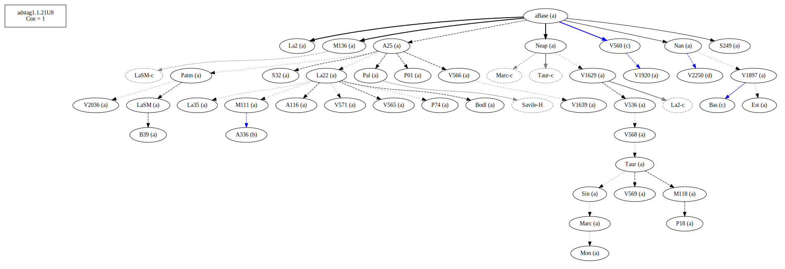
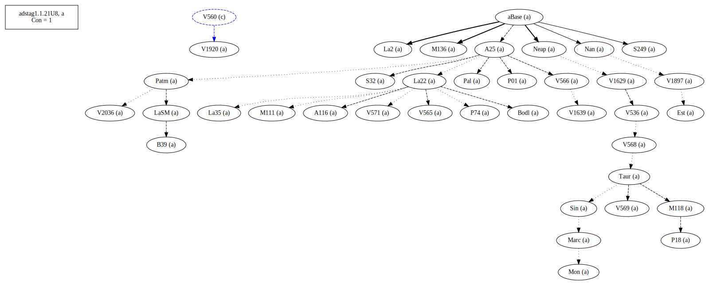
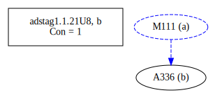
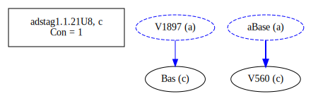
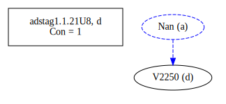

# Variant Analysis: AdStag1.1.21/8

Subjective or optative

## 📌 Variant Description
- **Location**: adstag1.1.21/8
- **Variant Units**: 
  - Reading A: ἐγγένηται
  - Reading B: γένοιται
  - Reading C: ἐγγένοιτο
  - Reading D: γένοιτο

## 🧬 Manuscript Support
| Reading | Manuscripts | Notes |
|--------|-------------|-------|
| A      | All but below | A25 La22 Nan majority |
| B      | A336 | lone |
| C      | Bas V560  | oldest |
| D      | V2250   | lone |

## 🧠 Internal Evidence
- **Transcriptional Probability**: [e.g., Reading A is shorter and more difficult]
- **Stylistic/Contextual Fit**: [e.g., Reading B aligns with second sophistic style]

## 🧭 External Evidence
- **Manuscript Age**: [e.g., Reading A supported by earlier MSS]
- **Geographical Spread**: []

## 🔄 Directionality & Genealogy
- **Likely Original Reading**: [e.g., Reading A]
- **Genealogical Relationships**:
  - [e.g., B likely derived from A via harmonization]
  - [e.g., C appears to be a conflation of A and B]
## 🔄 Directionality & Genealogy
- **Likely Original Reading**: [e.g., Reading A]
- **Genealogical Relationships**:
  - [e.g., B likely derived from A via harmonization]
  - [e.g., C appears to be a conflation of A and B]
- **Textual flow**:

- **Coherence of variants (readings)**

## 🌿 Local Stemma Placement
- **Proposed Stemma**:
  - [Diagram or description, e.g., A → B → C]
- **Contamination Notes**: [e.g., Manuscript F shows mixture of A and B]

## 📝 Notes & Decisions
- Two of the odest have optative and the other variants reflect an optative in the background.

---