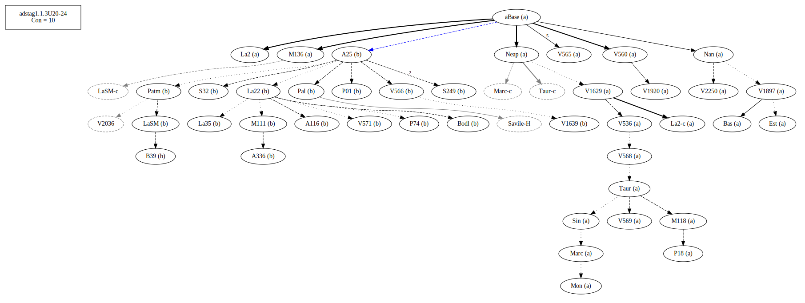
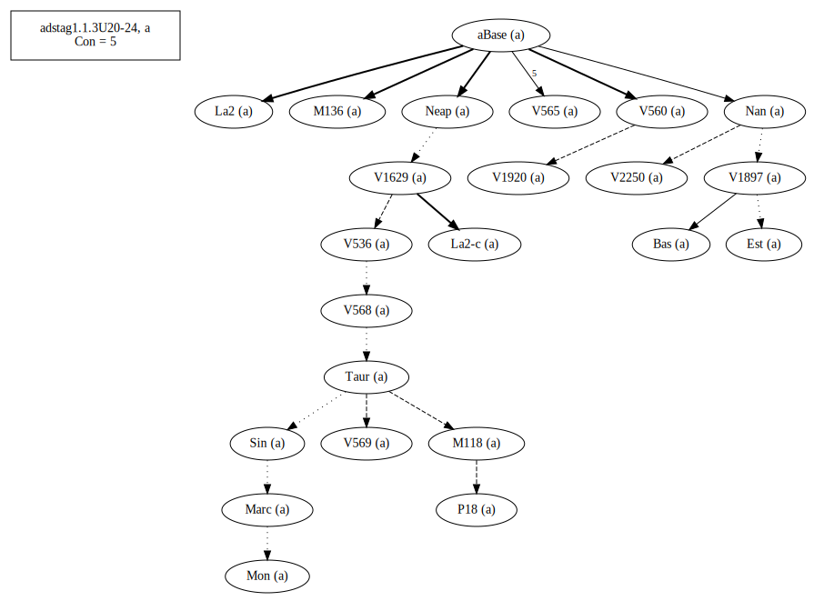
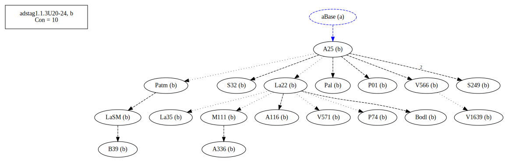

# Variant Analysis: AdStag1.1.3/20-22

Dative or preposition

## 📌 Variant Description
- **Location**: adstag1.1.3/20-22
- **Variant Units**: 
  - Reading A: τῆ κεφαλῆ
  - Reading B: εἰς τὴν κεφαλὴν

## 🧬 Manuscript Support
| Reading | Manuscripts | Notes |
|--------|-------------|-------|
| A      | P74 Pal A25 La35 LaSM Patm S249 V1639 P01 S32 A336 A116 M111 V566 Bodl V571 B39 La22 | A25 La22 ... editions, c=92.96 |
| B      | P18 V1897 V2250 Bas La2 M118 V565 V560 M136 Sin Neap V1920 Nan V568 V536 Mon V1629 V569 Est Marc Taur | Bas V560 Nan, c=82.43  |

## 🧠 Internal Evidence
- **Transcriptional Probability**: [e.g., Reading A is shorter and more difficult]
- **Stylistic/Contextual Fit**: [e.g., Reading B aligns with second sophistic style]

## 🧭 External Evidence
- **Manuscript Age**: [e.g., Reading A supported by earlier MSS]
- **Geographical Spread**: []

## 🔄 Directionality & Genealogy
- **Likely Original Reading**: [e.g., Reading A]
- **Genealogical Relationships**:
  - [e.g., B likely derived from A via harmonization]
  - [e.g., C appears to be a conflation of A and B]
- **Textual flow**:

- **Coherence of variants (readings)**

## 🌿 Local Stemma Placement
- **Proposed Stemma**:
  - [Diagram or description, e.g., A → B → C]
- **Contamination Notes**: [e.g., Manuscript F shows mixture of A and B]

## 📝 Notes & Decisions
- The oldest are in B. They also pull the coherence down, since theirs is always low. Still worth reviewing. Not sure. Something seems to be between the initial text and those with reading "b". Keep an eye on it. The group under A25 is solid.

---