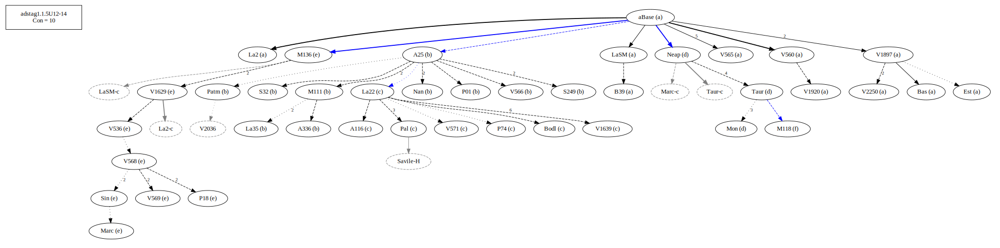
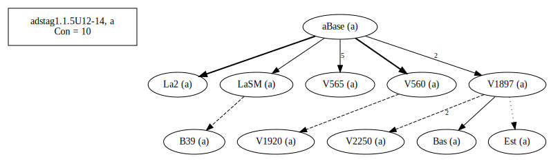
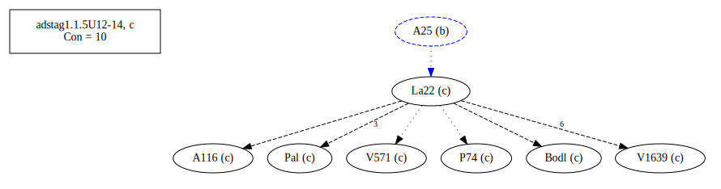
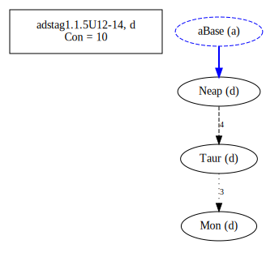
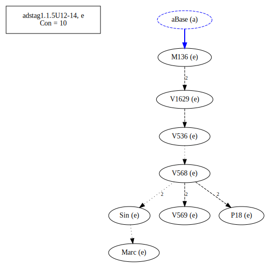
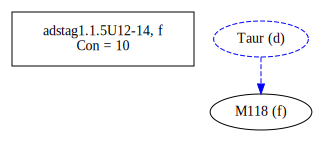

# Variant Analysis: AdStag1.1.5/12-14

## 📌 Variant Description
- **Location**: adstag1.1.5/12-14
- **Variant Units**: 
  - Reading A: ἂν οἴηται
  - Reading B: ἂν οἴοιται
  - Reading C: ἂν οἴοιτο
  - Reading D: οἷάτε ἦν
  - Reading E: ἂν οἷάτε ἡμῖν
  - Reading F: ἂν οἷάτε ἦν

## 🧬 Manuscript Support
| Reading | Manuscripts | Notes |
|--------|-------------|-------|
| A      | B39 Bas Base Est La2 LaSM V1897 V1920 V2250 V560 V565 | [group description?] |
| B      | A25 A336 La35 M111 Nan P01 Patm S249 S32 V566 Savile    |  |
| C      | A116 Bodl La22 P74 Pal V1639 V571      |  |
| D      | M136 Marc P18 Sin V1629 V536 V568 V569 |  |
| E      | M118 | lone |
| F      | Mon Neap Taur | |

## 🧠 Internal Evidence
- **Transcriptional Probability**: [e.g., Reading A is shorter and more difficult]
- **Stylistic/Contextual Fit**: [e.g., Reading B aligns with second sophistic style]

## 🧭 External Evidence
- **Manuscript Age**: [e.g., Reading A supported by earlier MSS]
- **Geographical Spread**: []

## 🔄 Directionality & Genealogy
- **Likely Original Reading**: [e.g., Reading A]
- **Genealogical Relationships**:

- ## open-cbgm textual flow##

- ## open-cbgm attestations##

## 🌿 Local Stemma Placement
- **Proposed Stemma**:
  - [Diagram or description, e.g., A → B → C]
- **Contamination Notes**: [e.g., Manuscript F shows mixture of A and B]

## 📝 Notes & Decisions
- [Any additional observations, uncertainties, or decisions made]

---
