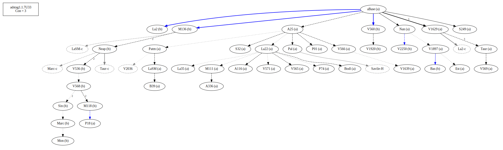
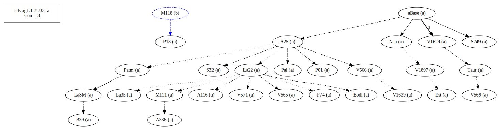
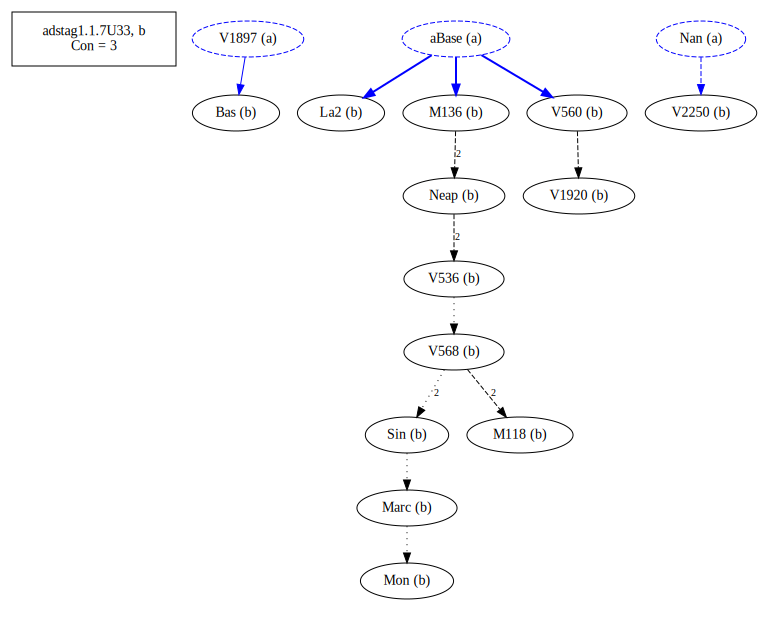

# Variant Analysis: AdStag1.1.7/33

With or without definite article.

## 📌 Variant Description
- **Location**: adstag1.1.7/33
- **Variant Units**: 
  - Reading A: ῥημάτων
  - Reading B: τῶν ῥημάτων

## 🧬 Manuscript Support
| Reading | Manuscripts | Notes |
|--------|-------------|-------|
| A      | P18 P74 V1897 Pal A25 La35 LaSM Patm S249 V1639 P01 V565 S32 A336 A116 Nan M111 V566 Bodl V571 V1629 V569 B39 Est Taur La22 | A25 La22 majority, editions |
| B      | V2250 Bas La2 M118 V560 M136 Sin Neap V1920 V568 V536 Mon Marc | Bas V560 ... |
| C      | [e.g., F]       | [lone] |

## 🧠 Internal Evidence
- **Transcriptional Probability**: [e.g., Reading A is shorter and more difficult]
- **Stylistic/Contextual Fit**: [e.g., Reading B aligns with second sophistic style]

## 🧭 External Evidence
- **Manuscript Age**: [e.g., Reading A supported by earlier MSS]
- **Geographical Spread**: []

## 🔄 Directionality & Genealogy
- **Likely Original Reading**: [e.g., Reading A]
- **Genealogical Relationships**:
  - [e.g., B likely derived from A via harmonization]
  - [e.g., C appears to be a conflation of A and B]
- ## open-cbgm textual flow##

- ## open-cbgm attestations##

## 🌿 Local Stemma Placement
- **Proposed Stemma**:
  - [Diagram or description, e.g., A → B → C]
- **Contamination Notes**: [e.g., Manuscript F shows mixture of A and B]

## 📝 Notes & Decisions
- [Any additional observations, uncertainties, or decisions made]

---