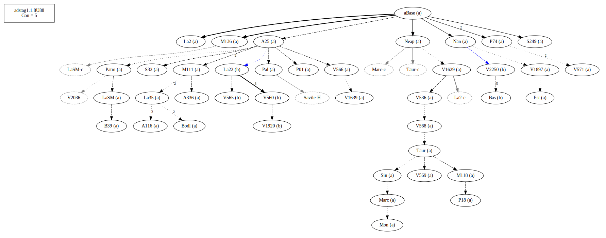
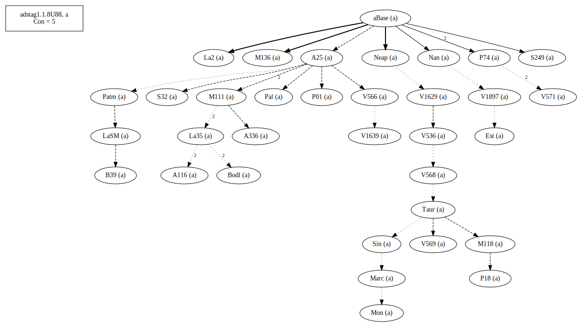
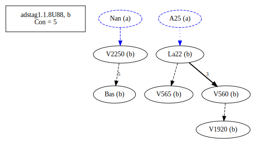

# Variant Analysis: AdStag1.1.8/88

## 📌 Variant Description
- **Location**: adstag1.1.8/88
- **Variant Units**: 
  - Reading A: αὐτοὺς
  - Reading B: omit

## 🧬 Manuscript Support
| Reading | Manuscripts | Notes |
|--------|-------------|-------|
| A      | All but those in B | [group description?] |
| B      | V2250 Bas V565 V560 V1920 La22 | Bas V560 La22 |

## 🧠 Internal Evidence
- **Transcriptional Probability**: [e.g., Reading A is shorter and more difficult]
- **Stylistic/Contextual Fit**: [e.g., Reading B aligns with second sophistic style]

## 🧭 External Evidence
- **Manuscript Age**: [e.g., Reading A supported by earlier MSS]
- **Geographical Spread**: []

## 🔄 Directionality & Genealogy
- **Likely Original Reading**: [e.g., Reading A]
- **Genealogical Relationships**:
  - [e.g., B likely derived from A via harmonization]
  - [e.g., C appears to be a conflation of A and B]
- ## open-cbgm textual flow##

- ## open-cbgm attestations##

## 🌿 Local Stemma Placement
- **Proposed Stemma**:
  - [Diagram or description, e.g., A → B → C]
- **Contamination Notes**: [e.g., Manuscript F shows mixture of A and B]

## 📝 Notes & Decisions
- There is decent support for B.

---