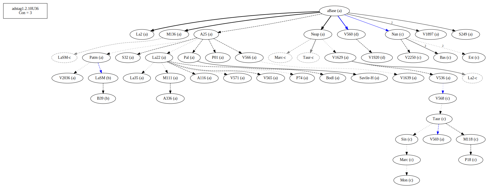
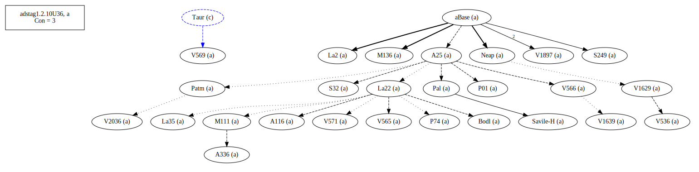
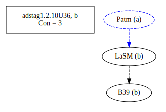
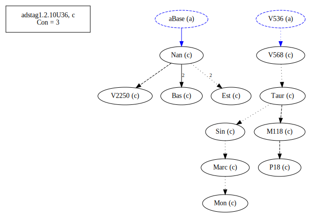
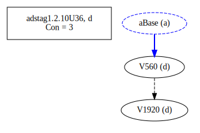

# Variant Analysis: AdStag1.2.10/36

Conditional or final?
Cf. 1.2.12

## 📌 Variant Description
- **Location**: adstag1.2.10/36
- **Variant Units**: 
  - Reading A: ἢν μὴ
  - Reading B: ἐὰν μὴ
  - Reading C: ἂν μὴ
  - Reading D: ἳν' μὴ

## 🧬 Manuscript Support
| Reading | Manuscripts | Notes |
|--------|-------------|-------|
| A      | All but below | Majority, editions |
| B      | LaSM B39 |  |
| C      | P18 V2250 Bas M118 Sin Nan V568 Mon Est Marc Taur      | Bas, Nan V568 |
| D      | V560 V1920|        |

## 🧠 Internal Evidence
- **Transcriptional Probability**: [e.g., Reading A is shorter and more difficult]
- **Stylistic/Contextual Fit**: [e.g., Reading B aligns with second sophistic style]

## 🧭 External Evidence
- **Manuscript Age**: [e.g., Reading A supported by earlier MSS]
- **Geographical Spread**: []

## 🔄 Directionality & Genealogy
- **Likely Original Reading**: [e.g., Reading A]
- **Genealogical Relationships**:
  - [e.g., B likely derived from A via harmonization]
  - [e.g., C appears to be a conflation of A and B]
- ## open-cbgm textual flow##

- ## open-cbgm attestations##

## 🌿 Local Stemma Placement
- **Proposed Stemma**:
  - [Diagram or description, e.g., A → B → C]
- **Contamination Notes**: [e.g., Manuscript F shows mixture of A and B]

## 📝 Notes & Decisions
- Must be studied closely with 39 (addition of a verb in the subjunctive)

---