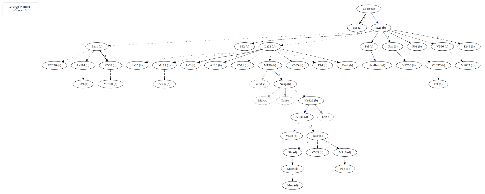
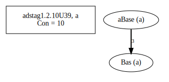
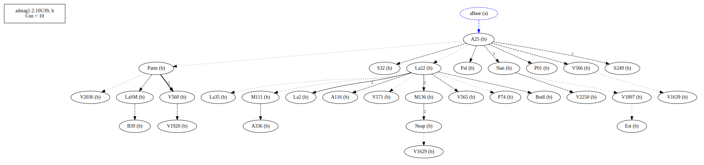
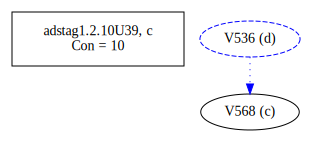
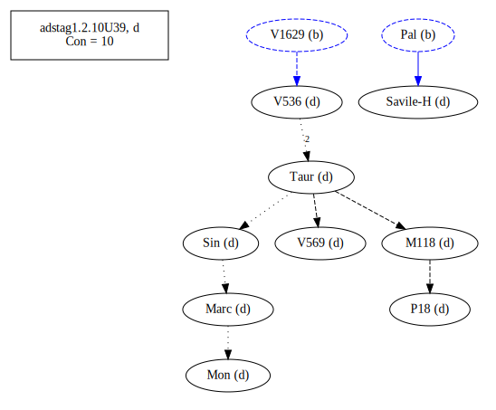

# Variant Analysis: AdStag1.2.10/39

## 📌 Variant Description
- **Location**: adstag1.2.10/39
- **Variant Units**: 
  - Reading A: omit
  - Reading B: θελήσωμεν
  - Reading C: συνγχωρήσωμεν
  - Reading D: ἐγχωρήσωμεν
 

## 🧬 Manuscript Support
| Reading | Manuscripts | Notes |
|--------|-------------|-------|
| A      |  Bas               | lone  |
| B      | P74 V1897 V2250 Pal A25 La35 LaSM La2 Patm S249 V1639 P01 V565 V560 S32 M136 Neap A336 A116 V1920 V2036 Nan M111 V566 Bodl V571 V1629 B39 Est La22 | Majority, editions |
| C      | P19 M118 Sin V536 Mon V569 Marc Taur Savile-H    | Taur-group |
| D      |  V568    |  |

## 🧠 Internal Evidence
- **Transcriptional Probability**: [e.g., Reading A is shorter and more difficult]
- **Stylistic/Contextual Fit**: [e.g., Reading B aligns with second sophistic style]

## 🧭 External Evidence
- **Manuscript Age**: [e.g., Reading A supported by earlier MSS]
- **Geographical Spread**: []

## 🔄 Directionality & Genealogy
- **Likely Original Reading**: [e.g., Reading A]
- **Genealogical Relationships**:
  - [e.g., B likely derived from A via harmonization]
  - [e.g., C appears to be a conflation of A and B]
- ## open-cbgm textual flow##

- ## open-cbgm attestations##

## 🌿 Local Stemma Placement
- **Proposed Stemma**:
  - [Diagram or description, e.g., A → B → C]
- **Contamination Notes**: [e.g., Manuscript F shows mixture of A and B]

## 📝 Notes & Decisions
- The only similarity between a and b-c is semantic. There was felt to be a need for something.
- I am going with Bas

---