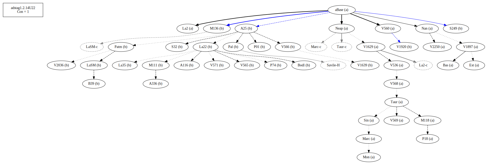
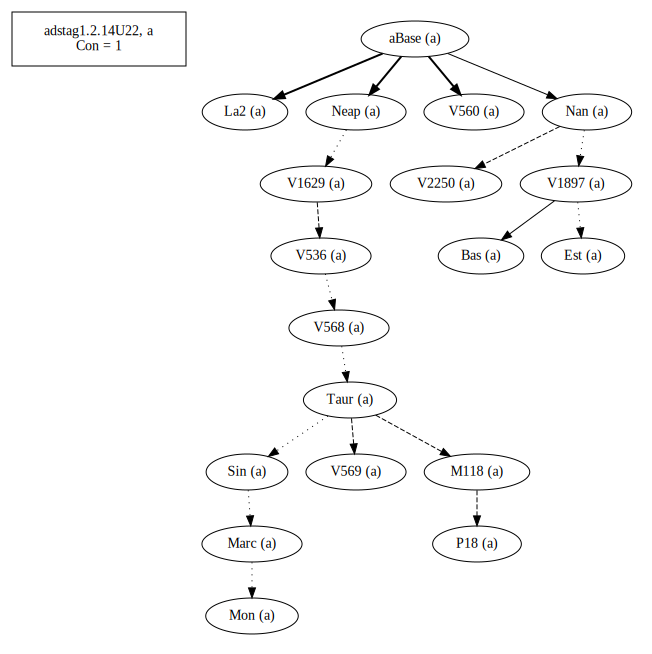
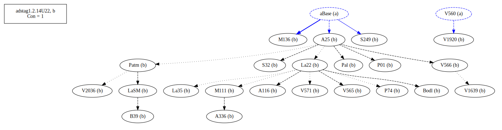
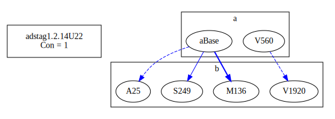
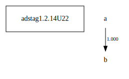

# Variant Analysis: AdStag1.2.15/22

## 📌 Variant Description
- **Location**: adstag1.2.14/22
- **Variant Units**: 
  - Reading A: ἦν
  - Reading B: ἦν ἢ

## 🧬 Manuscript Support
| Reading | Manuscripts | Notes |
|--------|-------------|-------|
| A      | Bas Est La2 M118 Marc Mon Nan Neap P18 Sin Taur V1629 V1897 V2250 V536 V560 V568 V569 | Bas La2 and Nan and Taur-group |
| B      | A116 A25 A336 B39 Bodl La22 La35 LaSM M111 M136 P01 P74 Pal Patm S249 S32 V1639 V1920 V2036 V565 V566 V571    | Good mss editions |

## 🧠 Internal Evidence
- **Transcriptional Probability**: [e.g., Reading A is shorter and more difficult]
- **Stylistic/Contextual Fit**: [e.g., Reading B aligns with second sophistic style]

## 🧭 External Evidence
- **Manuscript Age**: [e.g., Reading A supported by earlier MSS]
- **Geographical Spread**: []

## 🔄 Directionality & Genealogy
- **Likely Original Reading**: [e.g., Reading A]
- **Genealogical Relationships**:
  - [e.g., B likely derived from A via harmonization]
  - [e.g., C appears to be a conflation of A and B]
## open-cbgm textual flow ##

## open-cbgm attestations ##

## open-cbgm flow limited to variant readings ##

## Local stemma ##

- **Contamination Notes**: [e.g., Manuscript F shows mixture of A and B]

## 📝 Notes & Decisions
- A depicts somone of two possible groups, B someone of three groups. In A there is a further specification of the "unbelievers", that is, those who think everything happens automatically, in B there are unbelievers, those who think everything happens automatically and those who ascribe events to demons.

---