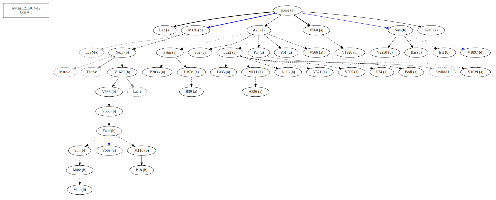
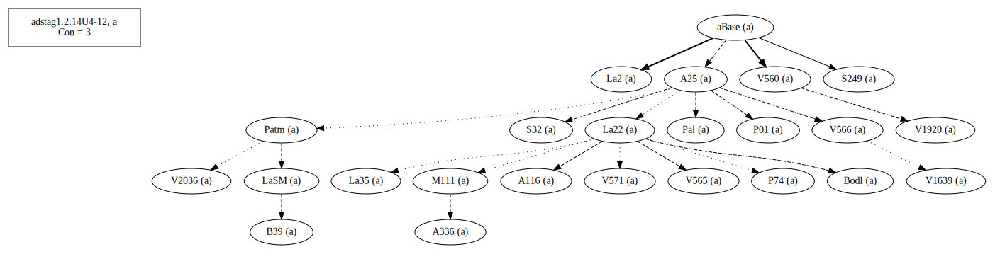
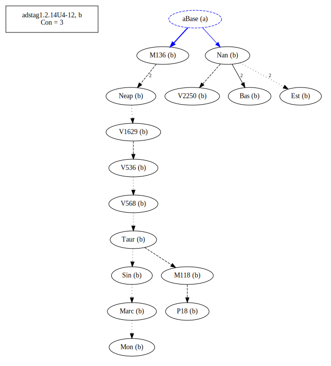
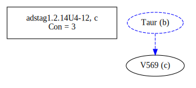
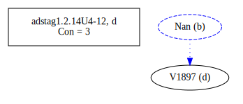

# Variant Analysis: AdStag1.2.14/4-12

## 📌 Variant Description
- **Location**: adstag1.2.14/4-12
- **Variant Units**: 
  - Reading A: μὲν οὖν πρός τινά μοι
  - Reading B: μὲν οὖν μοι πρός τινά
  - Reading C: μὲν οὖν μοι πρός τι τινά
  - Reading D: μὲν μοι οὖν πρός τινά

## 🧬 Manuscript Support
| Reading | Manuscripts | Notes |
|--------|-------------|-------|
| A      | P74 Pal A25 La35 LaSM La2 Patm S249 V1639 P01 V565 V560 S32 A336 A116 V1920 V2036 M111 V566 Bodl V571 B39 La22 | Most, editions |
| B      | P18 V2250 Bas M118 M136 Sin Neap Nan V568 V536 Mon V1629 Est Marc Taur | Bas Nan |
| C      | V569  |  |
| D      | V1897 |        |

## 🧠 Internal Evidence
- **Transcriptional Probability**: [e.g., Reading A is shorter and more difficult]
- **Stylistic/Contextual Fit**: [e.g., Reading B aligns with second sophistic style]

## 🧭 External Evidence
- **Manuscript Age**: [e.g., Reading A supported by earlier MSS]
- **Geographical Spread**: []

## 🔄 Directionality & Genealogy
- **Likely Original Reading**: [e.g., Reading A]
- **Genealogical Relationships**:
  - [e.g., B likely derived from A via harmonization]
  - [e.g., C appears to be a conflation of A and B]
## open-cbgm textual flow##

## open-cbgm attestations##

## 🌿 Local Stemma Placement
- **Proposed Stemma**:
  - [Diagram or description, e.g., A → B → C]
- **Contamination Notes**: [e.g., Manuscript F shows mixture of A and B]

## 📝 Notes & Decisions
- [Any additional observations, uncertainties, or decisions made]

---