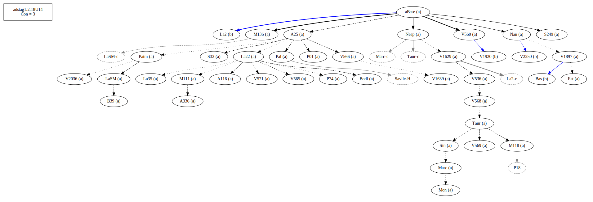
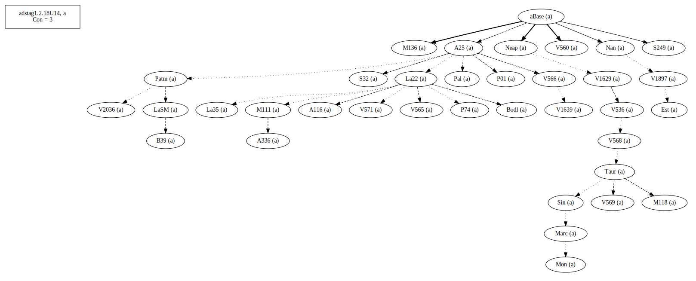
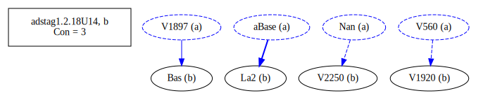
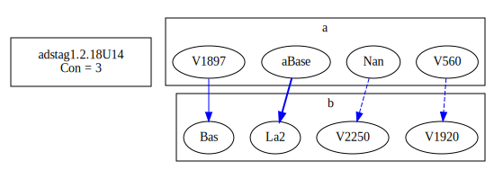
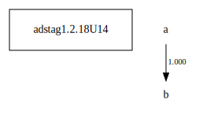

# Variant Analysis: AdStag1.2.18/14

## 📌 Variant Description
- **Location**: adstag1.2.18/14
- **Variant Units**: 
  - Reading A: τούτων
  - Reading B: omit
  

## 🧬 Manuscript Support
| Reading | Manuscripts | Notes |
|--------|-------------|-------|
| A      | All but those below | Majority |
| B      | Bas La2 V1920    | Old(est) |

## 🧠 Internal Evidence
- **Transcriptional Probability**: [e.g., Reading A is shorter and more difficult]
- **Stylistic/Contextual Fit**: [e.g., Reading B aligns with second sophistic style]

## 🧭 External Evidence
- **Manuscript Age**: [e.g., Reading A supported by earlier MSS]
- **Geographical Spread**: []

## 🔄 Directionality & Genealogy
- **Likely Original Reading**: [e.g., Reading A]
- **Genealogical Relationships**:
## open-cbgm textual flow ##

## open-cbgm attestations ##

## open-cbgm flow limited to variant readings ##

## Local stemma ##

  - [Diagram or description, e.g., A → B → C]
- **Contamination Notes**: [e.g., Manuscript F shows mixture of A and B]

## 📝 Notes & Decisions
- [Any additional observations, uncertainties, or decisions made]

---