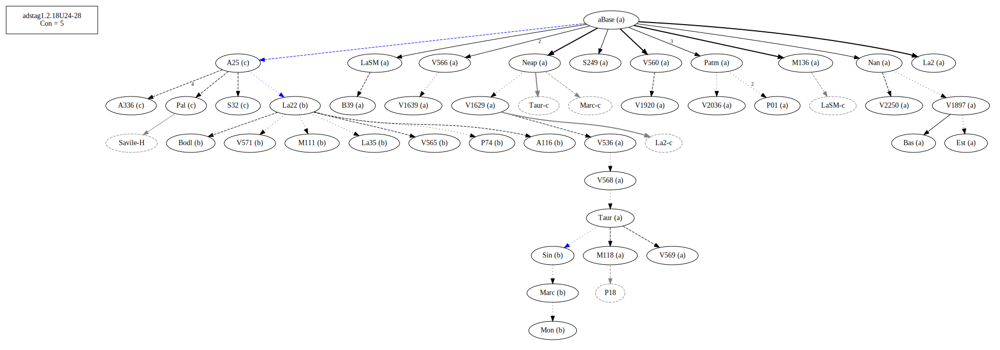
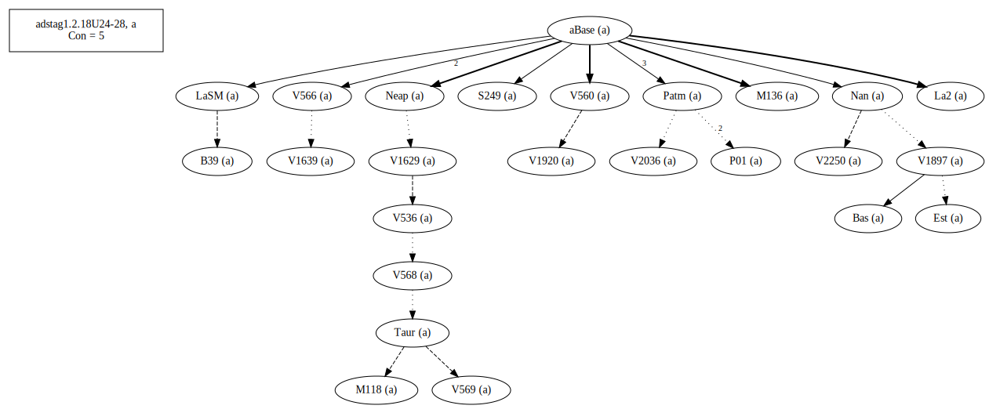
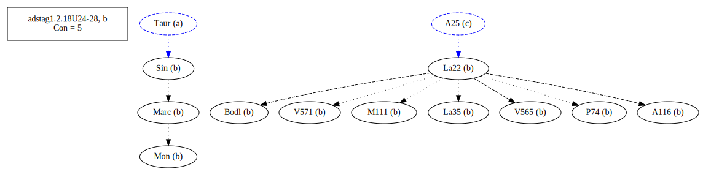
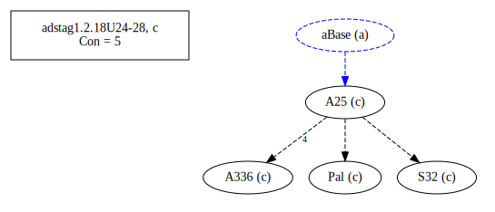
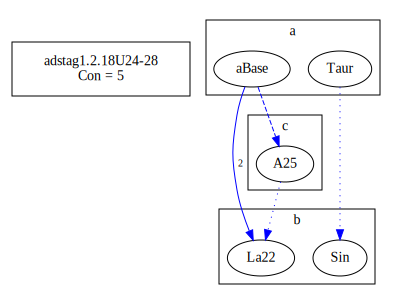
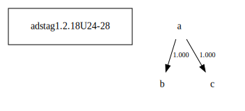

# Variant Analysis: AdStag1.2.18/24-38

## 📌 Variant Description
- **Location**: adstag1.2.18/24-28
- **Variant Units**: 
  - Reading A: μὴ σφόδρα ὢν (ἀγαθός)
  - Reading B: εἰ μὴ σφόδρα ἦν (ἀγαθός)
  - Reading C: εἰ μὴ σφόδρα ὢν (ἀγαθός)
## 🧬 Manuscript Support
| Reading | Manuscripts | Notes |
|--------|-------------|-------|
| A      | V1897 V2250 Bas LaSM La2 Patm S249 V1639 M118 P01 V560 M136 Neap V1920 V2036 Nan V566 V568 V536 V1629 V569 B39 Est Taur | Most, Savile |
| B      | P74 La35 V565 Sin A116 M111 Bodl V571 Mon Marc La22  | La22 et al, Migne |
| C      | Pal A25 S32 A336 | A25? Check transcription |

## 🧠 Internal Evidence
- **Transcriptional Probability**: The two are not due to transciptional errors
- **Stylistic/Contextual Fit**: A is a participial construction equivalent to a conditional clause. B has turned it explicitly into a conditional (irrealis) clause.

## 🧭 External Evidence
- **Manuscript Age**: [e.g., Reading A supported by earlier MSS]
- **Geographical Spread**: []

## 🔄 Directionality & Genealogy
- **Likely Original Reading**: [e.g., Reading A]
- **Genealogical Relationships**:
  - [e.g., B likely derived from A via harmonization]
  - [e.g., C appears to be a conflation of A and B]
## open-cbgm textual flow ##

## open-cbgm attestations ##

## open-cbgm flow limited to variant readings ##

## Local stemma ##

  - [Diagram or description, e.g., A → B → C]
- **Contamination Notes**: [e.g., Manuscript F shows mixture of A and B]

## 📝 Notes & Decisions
- It is more likely the paricipial construction would be made explicit than the other way around.

---