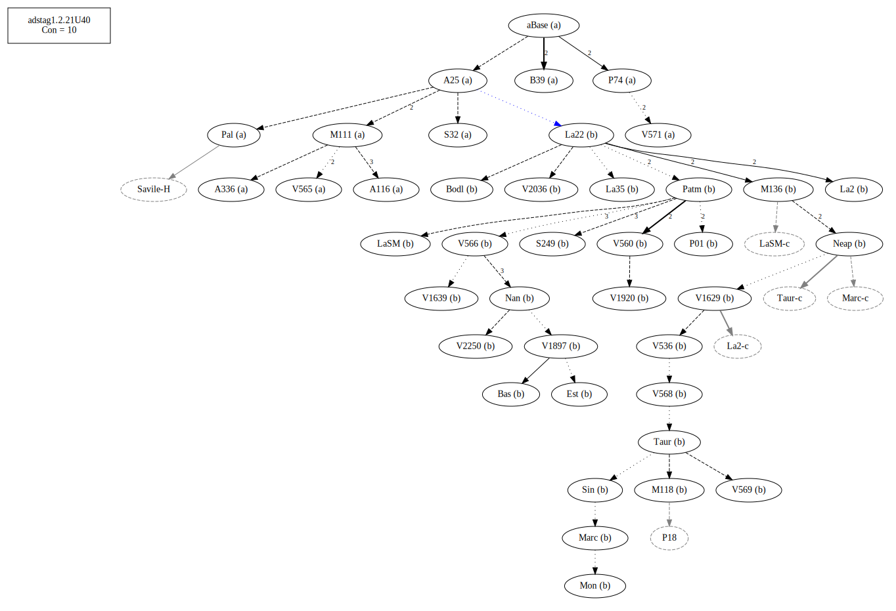
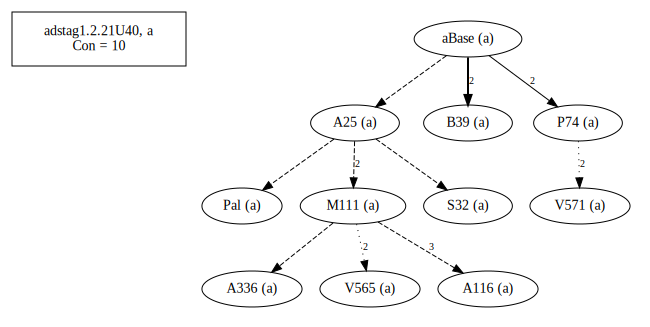
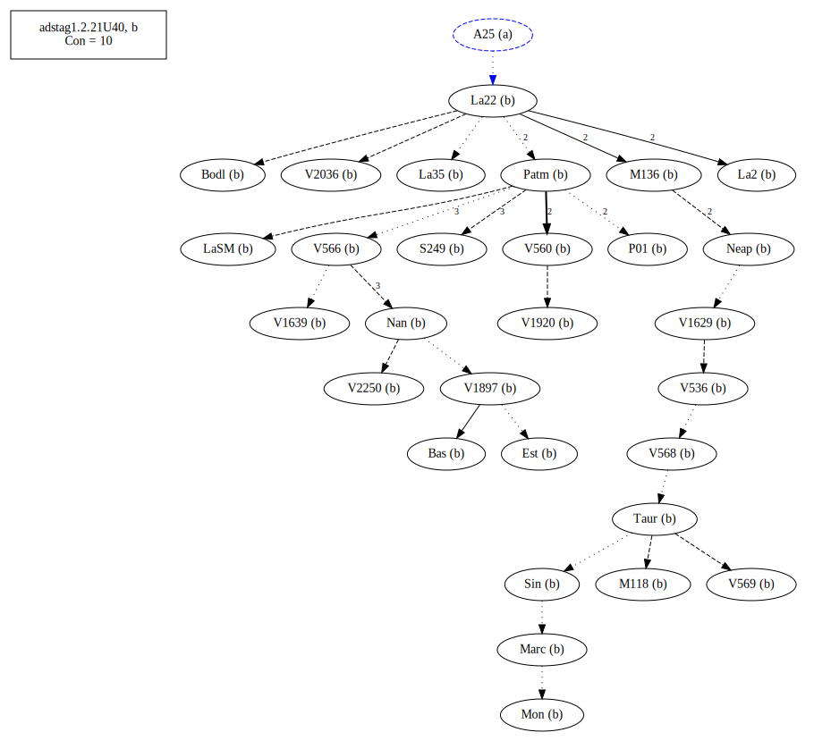
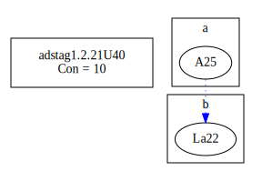
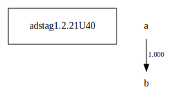

# Variant Analysis: AdStag1.2.21/40

Return to this. Seriously consider B with τὴν ἀρχὴν as the object. With A it would be an adverb?
Leaning towards B as the initial text.

## 📌 Variant Description
- **Location**: adstag1.2.21/40
- **Variant Units**: 
  - Reading A: ἀνηρτῆσθαι
  - Reading B: ἀνῃρῆσθαι

## 🧬 Manuscript Support
| Reading | Manuscripts | Notes |
|--------|-------------|-------|
| A      | A116 A25 A336 B39 M111 P74 Pal S32 V565 V571 | A25, some from La22 but not La22 |
| B      | Bas Bodl Est La2 La22 La35 LaSM M118 M136 Marc Mon Nan Neap P01 Patm S249 Sin Taur V1629 V1897 V1920 V2036 V2250 V536 V560 V566 V568 V569    | La22, Bas, Nan, Taur-group, Patm, editions |

## 🧠 Internal Evidence
- **Transcriptional Probability**: [e.g., Reading A is shorter and more difficult]
- **Stylistic/Contextual Fit**: [e.g., Reading B aligns with second sophistic style]

## 🧭 External Evidence
- **Manuscript Age**: [e.g., Reading A supported by earlier MSS]
- **Geographical Spread**: []

## 🔄 Directionality & Genealogy
- **Likely Original Reading**: [e.g., Reading A]
- **Genealogical Relationships**:
  - [e.g., B likely derived from A via harmonization]
  - [e.g., C appears to be a conflation of A and B]
## open-cbgm textual flow ##

## open-cbgm attestations ##

## open-cbgm flow limited to variant readings ##

## Local stemma ##

  - [Diagram or description, e.g., A → B → C]
- **Contamination Notes**: [e.g., Manuscript F shows mixture of A and B]

## 📝 Notes & Decisions
- Choice between verbs of the same semantic domain - hanging
- ἀναρτάω - pass to be hung up, 2. depend upon Med., also with pf. Pass. = Act, hence attach to oneself, make dependent upon one, subdue
- ἀναιρεω - LSJ B II take upon oneself τὴν ἀρχὴν

---