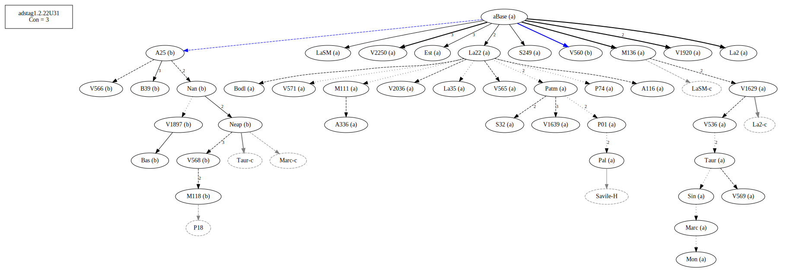
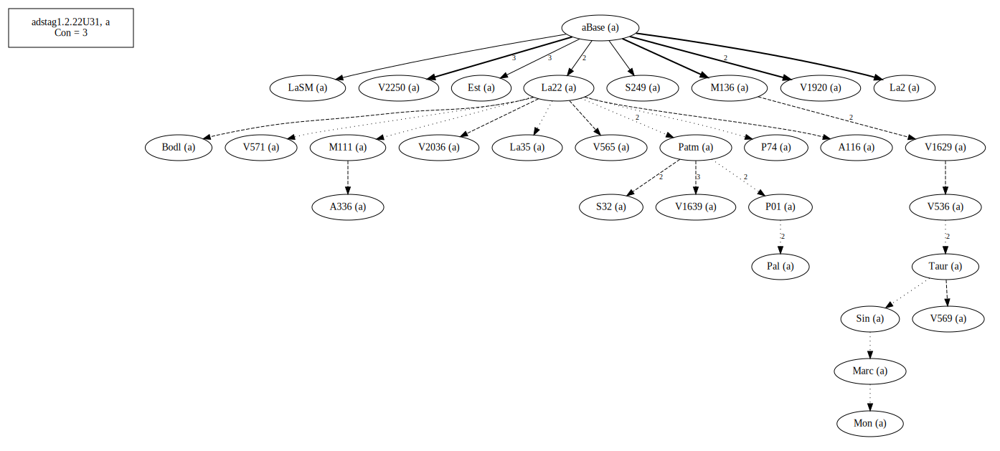
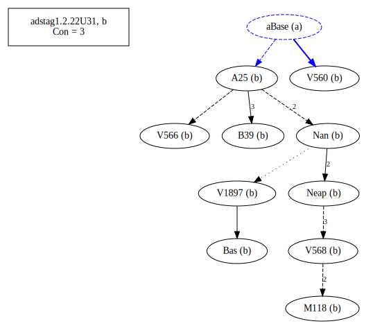
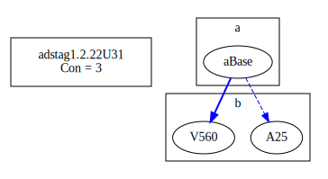
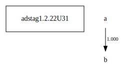

# Variant Analysis: AdStag1.2.22/31

## 📌 Variant Description
- **Location**: adstag1.2.22/31
- **Variant Units**: 
  - Reading A: omit τῆς
  - Reading B: τῆς (γῆς)

## 🧬 Manuscript Support
| Reading | Manuscripts | Notes |
|--------|-------------|-------|
| A      | All but those in B | Most, La22 and Taur-group, editions |
| B      | A25 B39 Bas M118 Nan Neap V1897 V560 V566 V568    | A25, Bas, Nan potential ancestors of Taur-group |

## 🧠 Internal Evidence
- **Transcriptional Probability**: Reading A is shorter and more difficult
- **Stylistic/Contextual Fit**:

## 🧭 External Evidence
- **Manuscript Age**: Both have representatives of oldest ms, A25 and La22
- **Geographical Spread**: []

## 🔄 Directionality & Genealogy
- **Likely Original Reading**: [e.g., Reading A]
- **Genealogical Relationships**:
## open-cbgm textual flow ##

## open-cbgm attestations ##

## open-cbgm flow limited to variant readings ##

## Local stemma ##

- **Proposed Stemma**:
  - [Diagram or description, e.g., A → B → C]
- **Contamination Notes**: [e.g., Manuscript F shows mixture of A and B]

## 📝 Notes & Decisions
- It is more likely that τῆς was added than uniformly omitted.

---