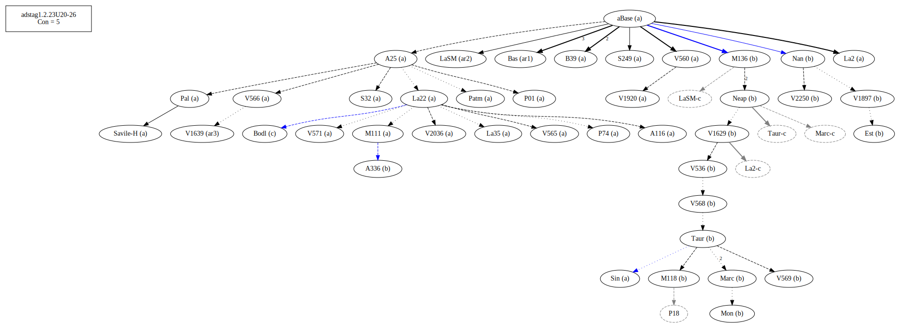
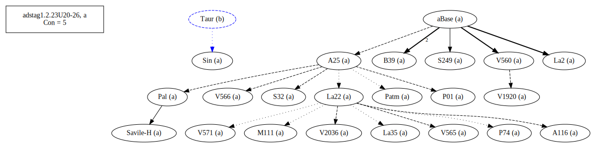
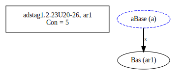
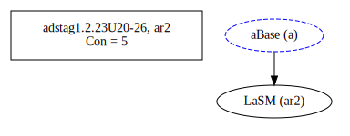
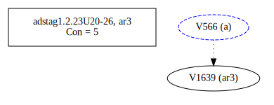
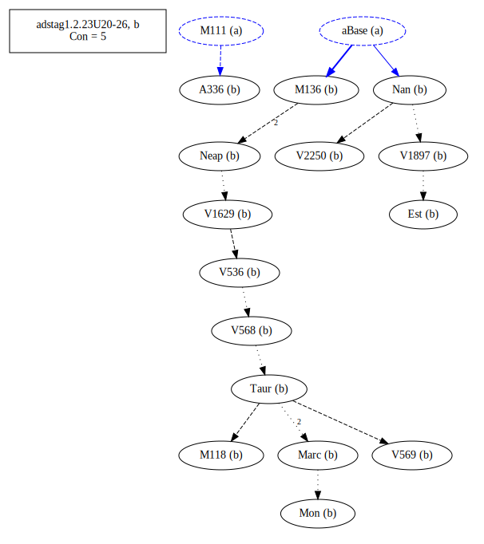
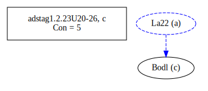
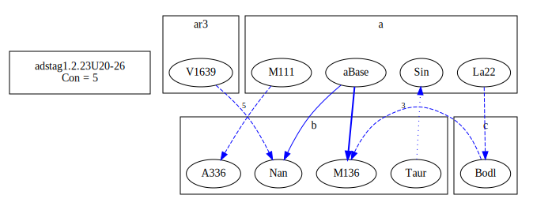
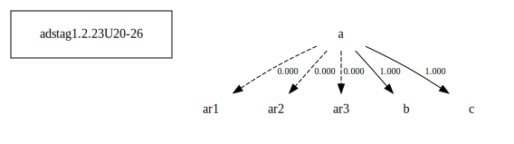

# Variant Analysis: AdStag1.2.23/20-26

## 📌 Variant Description
- **Location**: adstag1.2.23/20-26
- **Variant Units**: 
  - Reading A: τὰ λοιπὰ ἀναβέβηκε ζῶα
  - Reading B: τῶν λοιπῶν ἀναβέβηκε ζώων
  - Reading C: τὰ λοιπὰ ὑπεραναβέβηκε ζῶα

## 🧬 Manuscript Support
| Reading | Manuscripts | Notes |
|--------|-------------|-------|
| A      | A116 A25 B39 Bas La2 La22 La35 LaSM M111 P01 P74 Pal Patm S249 S32 Sin V1639 V1920 V2036 V560 V565 V566 V572 Savile-h | Oldest A25, Bas La22 even from Taur-group (Sin) |
| B      | A336 Est M118 M136 Marc Mon Nan Neap Taur V1629 V1897 V2250 V536 V568 V569       | Taur-group editions |
| C      | Bodl    | lone attempt at clarification |

## 🧠 Internal Evidence
- **Transcriptional Probability**: [e.g., Reading A is shorter and more difficult]
- **Stylistic/Contextual Fit**: [e.g., Reading B aligns with second sophistic style]

## 🧭 External Evidence
- **Manuscript Age**: [e.g., Reading A supported by earlier MSS]
- **Geographical Spread**: []

## 🔄 Directionality & Genealogy
- **Likely Original Reading**: [e.g., Reading A]
- **Genealogical Relationships**:
## open-cbgm textual flow ##

## open-cbgm attestations ##

## open-cbgm flow limited to variant readings ##

## Local stemma ##

- **Contamination Notes**: [e.g., Manuscript F shows mixture of A and B]

## 📝 Notes & Decisions
- [Any additional observations, uncertainties, or decisions made]

---