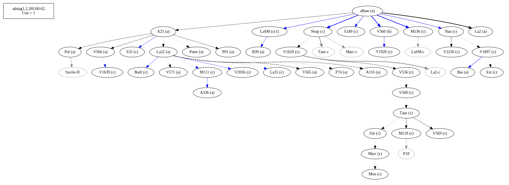
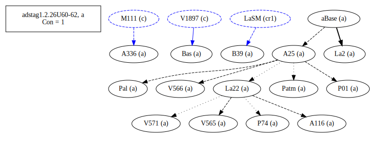
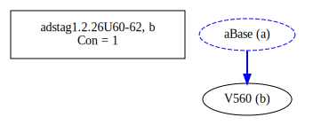
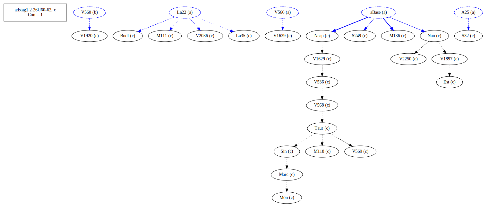
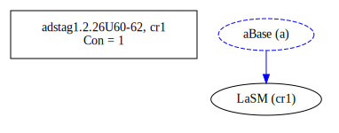
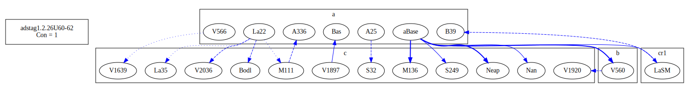
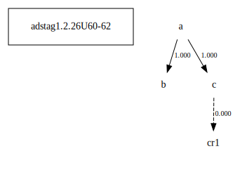

# Variant Analysis: AdStag1.2.26/60-62

## 📌 Variant Description
- **Location**: adstag1.2.26/60-62
- **Variant Units**: 
  - Reading A: καὶ τούτῳ
  - Reading B: καὶ τoῦτο
  - Reading C: κἀν τούτῳ

## 🧬 Manuscript Support
| Reading | Manuscripts | Notes |
|--------|-------------|-------|
| A      | P74 Pal A25 Bas La2 Patm P01 V565 A336 A116 V571 B39 La22 (LaSM)| Bas A25 La22 Patm |
| B      | V560 | lone, could be orthographic |
| C      | V1897 V2250 La35 S249 V1639 M118 S32 M136 Sin Neap V1920 V2036 Nan M111 V568 V536 Bodl Mon V1629 V569 Est Marc Taur | Most, Nan M111 ... |

## 🧠 Internal Evidence
- **Transcriptional Probability**: [e.g., Reading A is shorter and more difficult]
- **Stylistic/Contextual Fit**: [e.g., Reading B aligns with second sophistic style]

## 🧭 External Evidence
- **Manuscript Age**: [e.g., Reading A supported by earlier MSS]
- **Geographical Spread**: []

## 🔄 Directionality & Genealogy
- **Likely Original Reading**: [e.g., Reading A]
- **Genealogical Relationships**:
## open-cbgm textual flow ##

## open-cbgm attestations ##

## open-cbgm flow limited to variant readings ##

## Local stemma ##

- **Contamination Notes**: [e.g., Manuscript F shows mixture of A and B]

## 📝 Notes & Decisions
- [Any additional observations, uncertainties, or decisions made]

---