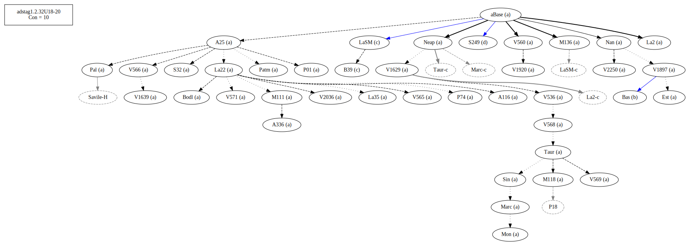
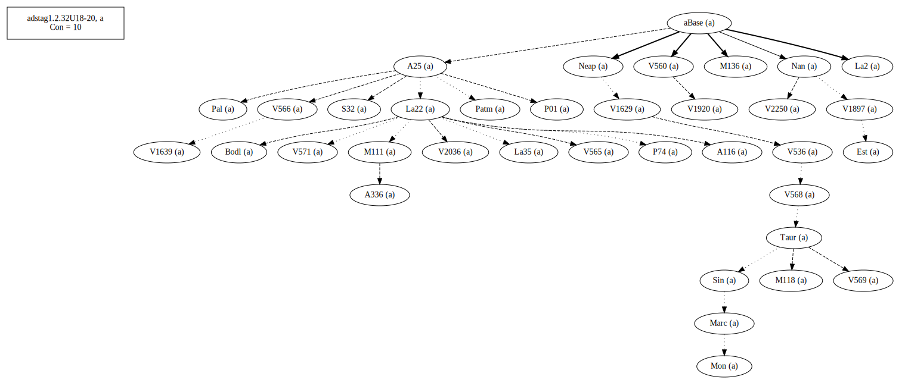
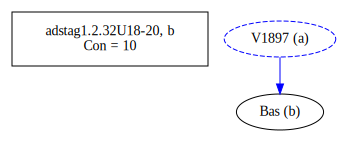
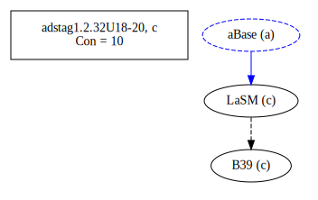
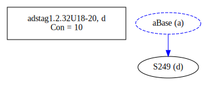
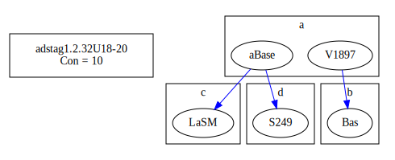
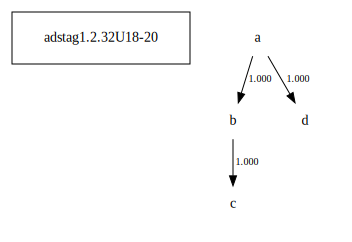

# Variant Analysis: AdStag1.2.32/18-20

## 📌 Variant Description
- **Location**: adstag1.2.32/18-20
- **Variant Units**: 
  - Reading A: (οὔτε μικρὸν εὐεργεσίας) ἕνεκεν ἐπιδειξαμένου
  - Reading B: (οὔτε μικρὸν εὐεργεσίας) ἕνεκεν εἶδος ἐπιδειξαμένου
  - Reading C: (οὔτε μικρὸν εὐεργεσίας) εἶδος ἕνεκεν ἐπιδειξαμἐνου

## 🧬 Manuscript Support
| Reading | Manuscripts | Notes |
|--------|-------------|-------|
| A      | A116 A25 A336 Bodl Est La2 La22 La35 M111 M118 M136 Marc Mon Nan Neap P01 P74 Pal Patm S32 Sin Taur V1629 V1639 V1897 V1920 V2036 V2250 V536 V560 V565 V566 V568 V569 V571 | Most, editions |
| B      | LaSM B39    | constant pair |
| C      | Bas       | lone, oldest |

## 🧠 Internal Evidence
- **Transcriptional Probability**: [e.g., Reading A is shorter and more difficult]
- **Stylistic/Contextual Fit**: [e.g., Reading B aligns with second sophistic style]

## 🧭 External Evidence
- **Manuscript Age**: [e.g., Reading A supported by earlier MSS]
- **Geographical Spread**: []

## 🔄 Directionality & Genealogy
- **Likely Original Reading**: [e.g., Reading A]
- **Genealogical Relationships**:
## open-cbgm textual flow ##

## open-cbgm attestations ##

## open-cbgm flow limited to variant readings ##

## Local stemma ##

- **Contamination Notes**: [e.g., Manuscript F shows mixture of A and B]

## 📝 Notes & Decisions
- Bas with a lone reading, but similar to LaSM and B39.

---