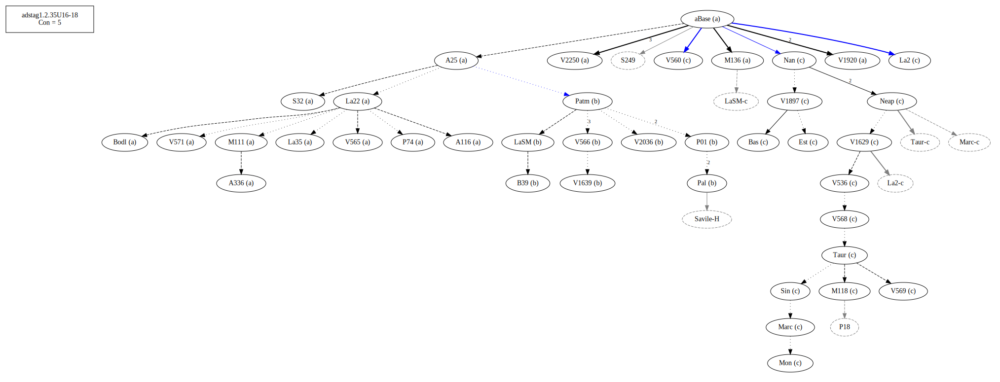
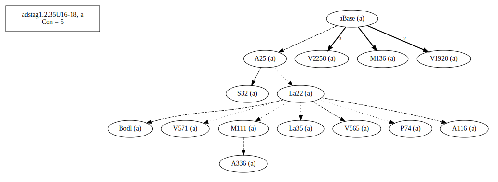
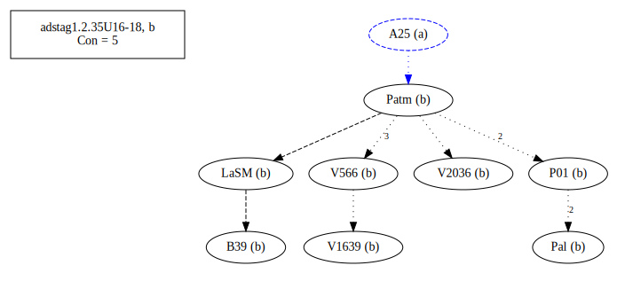
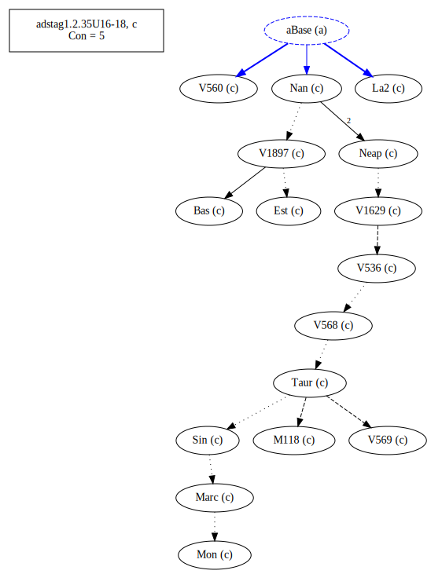
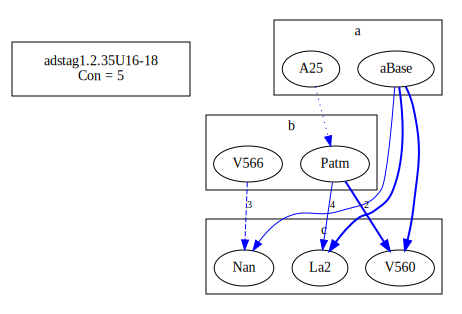
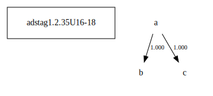

# Variant Analysis: AdStag1.2.35/16-18

Come back to. Bas might be correct.

## 📌 Variant Description
- **Location**: adstag1.2.35/16-18
- **Variant Units**: 
  - Reading A: εὐεργετῶν αὐτὸν (διετέλεσε)
  - Reading B: αὐτὸν εὐεργετῶν (διετέλεσε)
  - Reading C: εὐεργετῶν (διετέλεσε)

## 🧬 Manuscript Support
| Reading | Manuscripts | Notes |
|--------|-------------|-------|
| A      | P74 V2250 A25 La35 M565 S32 M136 A336 A116 V1920 M111 Bodl V571 La22 | A25 La22 Migne |
| B      | Pal LaSM Patm V1639 P01 V2036 V566 B39 | Savile  |
| C      | V1897 Bas La2 M118 V560 Sin Neap Nan V568 V536 Mon V1629 V569 Est Marc Taur | Bas Nan La2|

## 🧠 Internal Evidence
- **Transcriptional Probability**: [e.g., Reading A is shorter and more difficult]
- **Stylistic/Contextual Fit**: [e.g., Reading B aligns with second sophistic style]

## 🧭 External Evidence
- **Manuscript Age**: [e.g., Reading A supported by earlier MSS]
- **Geographical Spread**: []

## 🔄 Directionality & Genealogy
- **Likely Original Reading**: [e.g., Reading A]
- **Genealogical Relationships**:
## open-cbgm textual flow ##

## open-cbgm attestations ##

## open-cbgm flow limited to variant readings ##

## Local stemma ##

- **Contamination Notes**: [e.g., Manuscript F shows mixture of A and B]

## 📝 Notes & Decisions
- [Any additional observations, uncertainties, or decisions made]

---