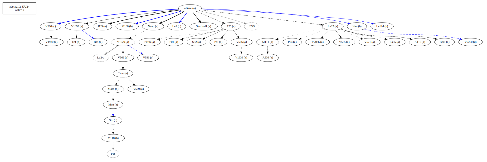
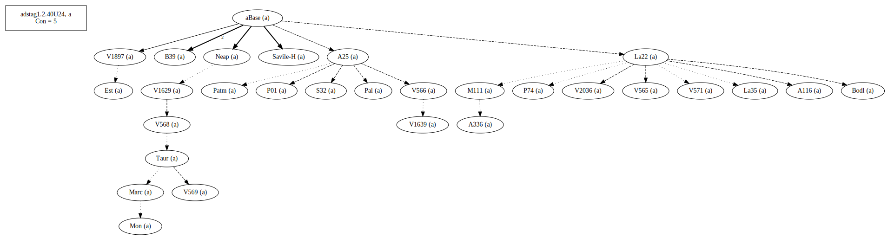
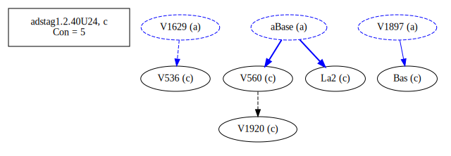

# Variant Analysis: AdStag1.2.40/24

## 📌 Variant Description
- **Variant unit**: adstag1.2.40/24

- **Variant Units**: 
  - Reading A: ἐπιστρέψαι
  - Reading B: ἀποτρέψαι
  - Reading C: ἀποστρέψαι
  - Reading C: omit

## 🧬 Manuscript Support
| Reading | Manuscripts | Notes |
|--------|-------------|-------|
| A      | Bas La2 V560 V1920 V536 |  |
| B      | P74 V1897 Pal A25 La35 Patm V1639 P01 V565 S32 Neap A336 A116 V2036 M111 V566 V568 Bodl V571 Mon V1629 V569 B39 Est Marc Taur La22   |  |
| C      | LaSM M118 M136 Sin Nan |  |
| D | V2250 | |

## 🧠 Internal Evidence
- **Transcriptional Probability**: [e.g., Reading A is shorter and more difficult]
- **Stylistic/Contextual Fit**: [e.g., Reading B aligns with second sophistic style]

## 🧭 External Evidence
- **Manuscript Age**: [e.g., Reading A supported by earlier MSS]
- **Geographical Spread**: []

## 🔄 Directionality & Genealogy
- **Likely Original Reading**: [e.g., Reading A]
  - [e.g., B likely derived from A via harmonization]
  - [e.g., C appears to be a conflation of A and B]
## open-cbgm textual flow ##

## open-cbgm attestations ##

## open-cbgm flow limited to variant readings ##

## Local stemma ##

- **Contamination Notes**: [e.g., Manuscript F shows mixture of A and B]

## 📝 Notes & Decisions
- [Any additional observations, uncertainties, or decisions made]

---