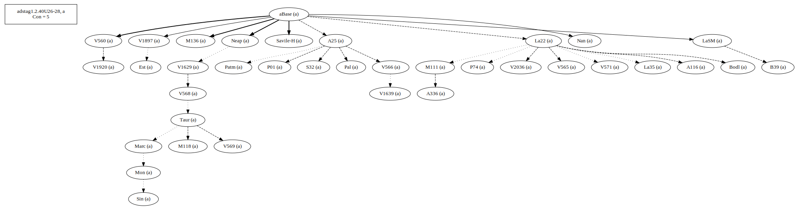
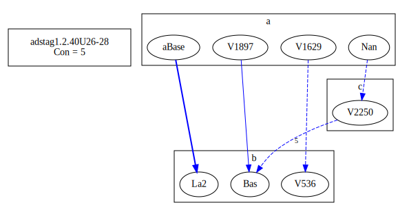

# Variant Analysis: AdStag1.2.40/26-28

## 📌 Variant Description
- **Variant unit**: adstag1.2.40/26-28

- **Variant Units**: 
  - Reading A: τοῦ ξύλου
  - Reading B: τὸ ξύλον
  - Reading C: omit

## 🧬 Manuscript Support
| Reading | Manuscripts | Notes |
|--------|-------------|-------|
| A      | P74 V1897 Pal A25 La35 LaSM Patm V1639 M118 P01 V565 V560 S32 M136 Sin Neap A336 A116 V1920 V2036 Nan M111 V566 V568 Bodl V571 Mon V1629 V569 B39 Est Marc Taur La22   | editions  |
| B      | Bas La2 V536 |  |
| C      | V2250   |  |

## 🧠 Internal Evidence
- **Transcriptional Probability**: [e.g., Reading A is shorter and more difficult]
- **Stylistic/Contextual Fit**: [e.g., Reading B aligns with second sophistic style]

## 🧭 External Evidence
- **Manuscript Age**: [e.g., Reading A supported by earlier MSS]
- **Geographical Spread**: []

## 🔄 Directionality & Genealogy
- **Likely Original Reading**: [e.g., Reading A]
  - [e.g., B likely derived from A via harmonization]
  - [e.g., C appears to be a conflation of A and B]
## open-cbgm textual flow ##

## open-cbgm attestations ##

## open-cbgm flow limited to variant readings ##

## Local stemma ##

- **Contamination Notes**: [e.g., Manuscript F shows mixture of A and B]

## 📝 Notes & Decisions
- [Any additional observations, uncertainties, or decisions made]

---
