# Variant Analysis: AdStag1.x.x

## 📌 Variant Description
- **Variant unit**: adstag1.x.x

- **Variant Units**: 
  - Reading A: ἀνώτερον ἀποφῆναι
  - Reading B: ἀνώτερον ἀποφεῖναι
  - Reading C: ἀνώτερον ἀφεῖναι
  - Reading D: ἀνώτερον ἀφῆναι
  - Reading E: ἀφίναι ἀνώτερον
  - Reading F: ἀνώτερον ἀπφεῖναι
  - Reading G: ἀνώτερον φανήναι
  - Reading H: ἀνώτερον φῆναι
  - Reading I: ἀφεῖναι
  - Reading J: ἀφῆναι

## 🧬 Manuscript Support
| Reading | Manuscripts | Notes |
|--------|-------------|-------|
| A      | Pal Bas P01 V536 | Editions |
| B      | A25 |  |
| C      | P74 La35 Patm V565 V560 S32 M136 Sin A336 A116 V1920 V2036 M111 Marc-c Bodl V571 Mon La22 |  |
| D      | LaSM V1639 Savile-H V566 |  |
| E      | La2 |  |
| F      | B39 |  |
| G      | V2250 |  |
| H      | V1897 Nan Est |  |
| I      | M118 Neap V568 V1629 Marc Taur |  |
| J      | V569 |  |

## 🧠 Internal Evidence
- **Transcriptional Probability**: [e.g., Reading A is shorter and more difficult]
- **Stylistic/Contextual Fit**: [e.g., Reading B aligns with second sophistic style]

## 🧭 External Evidence
- **Manuscript Age**: [e.g., Reading A supported by earlier MSS]
- **Geographical Spread**: []

## 🔄 Directionality & Genealogy
- **Likely Original Reading**: [e.g., Reading A]
  - [e.g., B likely derived from A via harmonization]
  - [e.g., C appears to be a conflation of A and B]
## open-cbgm textual flow ##
## open-cbgm textual flow ##
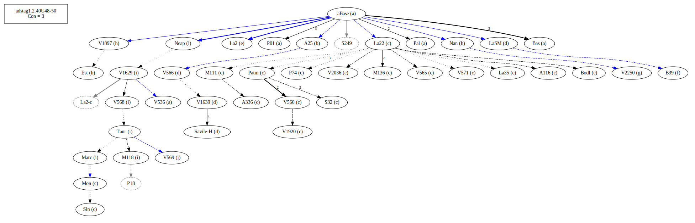
## open-cbgm attestations ##
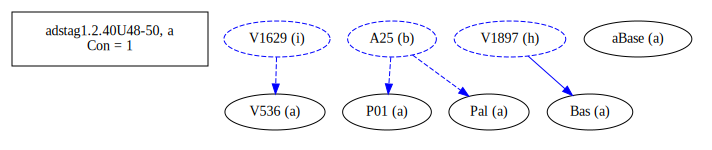
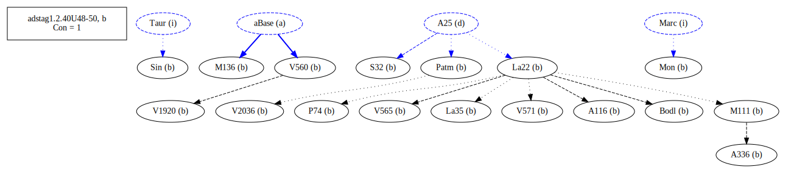

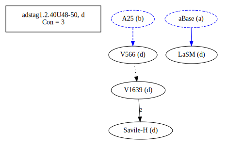
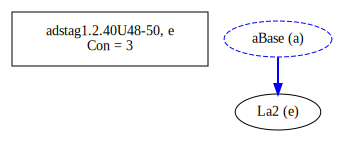
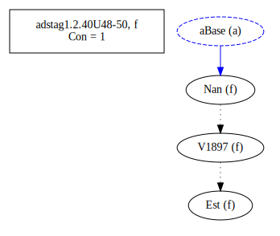
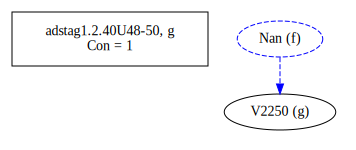
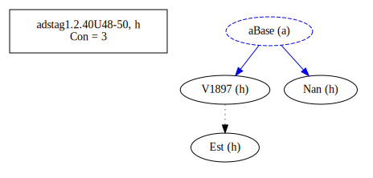
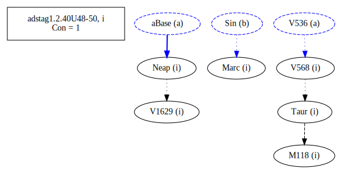
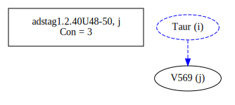
## open-cbgm flow limited to variant readings ##
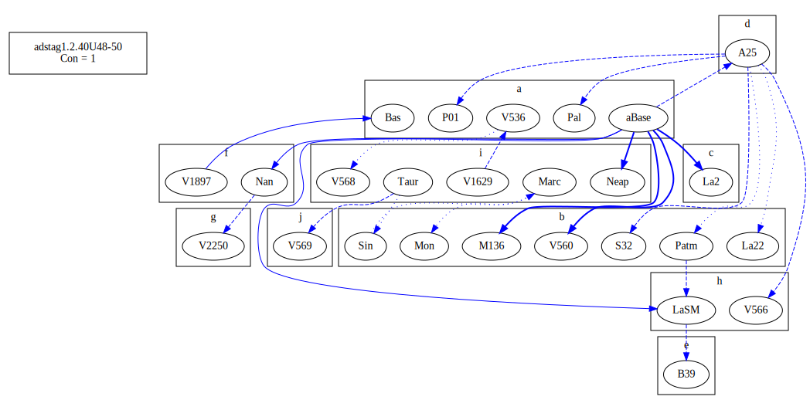
## Local stemma ##
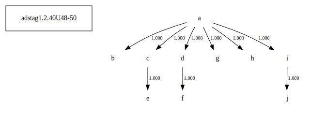

- **Contamination Notes**: [e.g., Manuscript F shows mixture of A and B]

## 📝 Notes & Decisions
- Needs much more work. Look into B (lone A25) and C

---