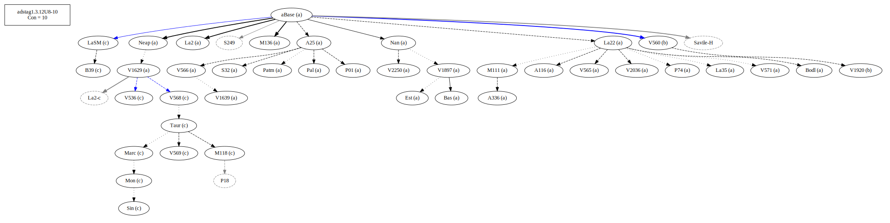
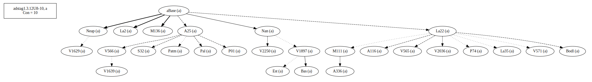
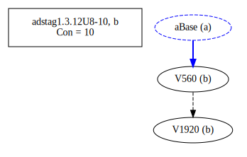
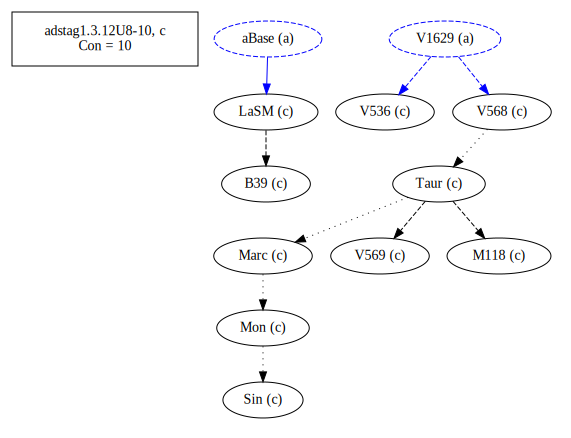
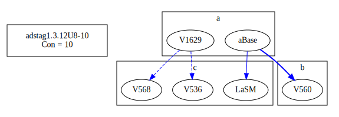
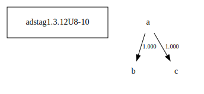

# Variant Analysis: AdStag1.3.12/8-10

## 📌 Variant Description
- **Variant unit**: adstag1.3.12/8-10

- **Variant Units**: 
  - Reading A: φησὶν ἐδίδαξεν
  - Reading B: ἐδίδαξεν φησὶν
  - Reading C: ἐδίδαξεν

## 🧬 Manuscript Support
| Reading | Manuscripts | Notes |
|--------|-------------|-------|
| A      | P74 V1897 V2250 Pal A25 Bas La35 La2 Patm V1639 P01 V565 S32 M136 Neap A336 A116 V2036 Nan M111 V566 Bodl V571 V1629 Est La22 | Most, editions |
| B      | V560 V1920   |  |
| C      | LaSM M118 Sin V568 V536 Mon V569 B39 Marc Taur  | Taur-group |

## 🧠 Internal Evidence
- **Transcriptional Probability**: [e.g., Reading A is shorter and more difficult]
- **Stylistic/Contextual Fit**: [e.g., Reading B aligns with second sophistic style]

## 🧭 External Evidence
- **Manuscript Age**: [e.g., Reading A supported by earlier MSS]
- **Geographical Spread**: []

## 🔄 Directionality & Genealogy
- **Likely Original Reading**: [e.g., Reading A]
  - [e.g., B likely derived from A via harmonization]
  - [e.g., C appears to be a conflation of A and B]
## open-cbgm textual flow ##

## open-cbgm attestations ##

## open-cbgm flow limited to variant readings ##

## Local stemma ##

- **Contamination Notes**: [e.g., Manuscript F shows mixture of A and B]

## 📝 Notes & Decisions
- [Any additional observations, uncertainties, or decisions made]

---