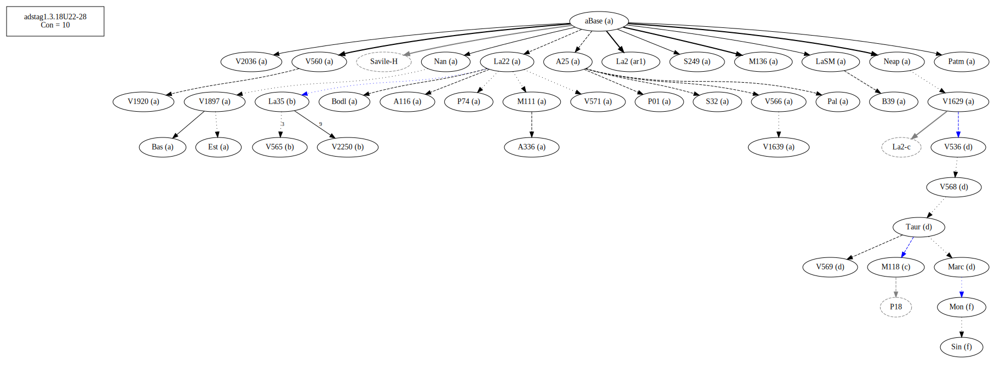
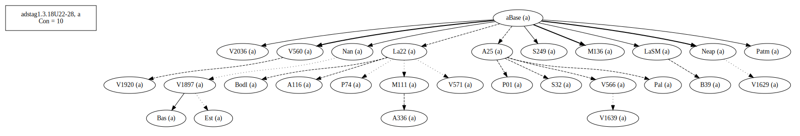
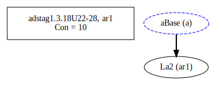
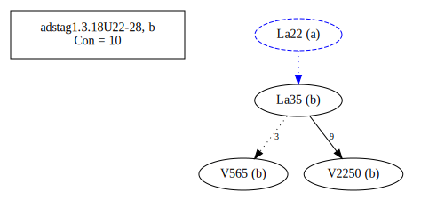
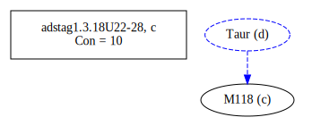
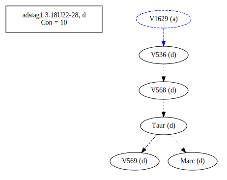
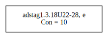
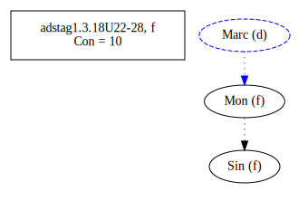
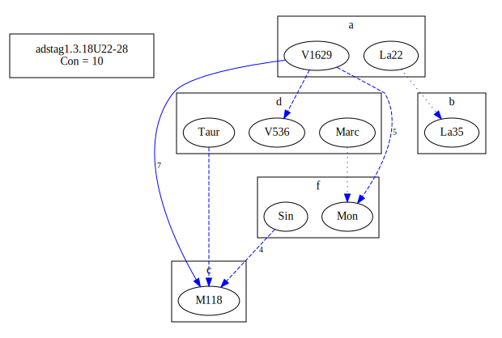
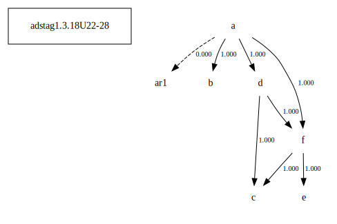

# Variant Analysis: AdStag1.3.18/22-28

## 📌 Variant Description
- **Variant unit**: adstag1.3.18/22-28

- **Variant Units**: 
  - Reading A: τὸ ταπεινοῦσθαι καὶ κάμπτεσθαι
  - Reading Ar1: τὸ ταπινοῦσθαι καὶ κάμπτεσθαι
  - Reading B: καὶ ταπεινοῦσθαι καὶ κάμπτεσθαι
  - Reading C: καὶ ταπεινοῦσθαι καὶ ἐπιστρέφεσθαι
  - Reading D: τὸ ταπεινοῦσθαι καὶ ἐπιστρέφεσθαι
  - Reading E: τὸ ταπεινοῦσθαι καὶ ἐπιστρέφεσθαι καὶ κάμπτεσθαι
  - Reading F: τὸ ταπεινοῦσθαι καὶ κάμπτεσθαι καὶ ἐπιστρέφεσθαι

## 🧬 Manuscript Support
| Reading | Manuscripts | Notes |
|--------|-------------|-------|
| A      | P74 V1897 Pal A25 Bas LaSM Patm S249 V1639 P01 V560 S32 M136 Neap A336 A116 V1920 V2036 Nan M111 V566 Bodl V571 V1629 B39 Est La22 | Savile |
| Ar1      |  La2  |  |
| B | V2250 La35 V565 | Migne|
| C      |  M118      |  |
| D      |  V568 V536 V569 Marc Taur  |  |
| E      |  Marc-c |  |
| F      |  Sin Mon     |  |

## 🧠 Internal Evidence
- **Transcriptional Probability**: [e.g., Reading A is shorter and more difficult]
- **Stylistic/Contextual Fit**: [e.g., Reading B aligns with second sophistic style]

## 🧭 External Evidence
- **Manuscript Age**: [e.g., Reading A supported by earlier MSS]
- **Geographical Spread**: []

## 🔄 Directionality & Genealogy
- **Likely Original Reading**: [e.g., Reading A]
  - [e.g., B likely derived from A via harmonization]
  - [e.g., C appears to be a conflation of A and B]
## open-cbgm textual flow ##

## open-cbgm attestations ##

## open-cbgm flow limited to variant readings ##

## Local stemma ##

- **Contamination Notes**: [e.g., Manuscript F shows mixture of A and B]

## 📝 Notes & Decisions
- [Any additional observations, uncertainties, or decisions made]

---