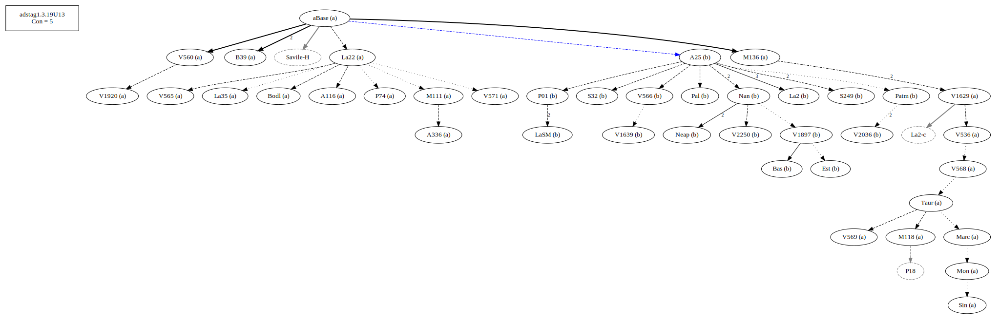
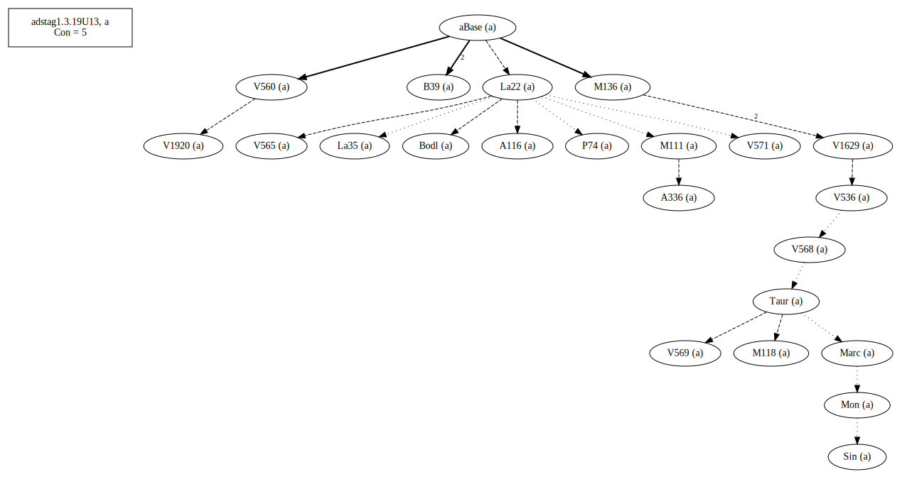
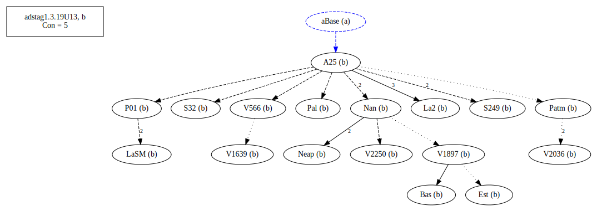
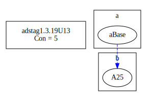
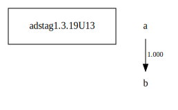

# Variant Analysis: AdStag1.3.19/13

## 📌 Variant Description
- **Variant unit**: adstag1.3.19/13

- **Variant Units**: 
  - Reading A: omit
  - Reading B: κύριε

## 🧬 Manuscript Support
| Reading | Manuscripts | Notes |
|--------|-------------|-------|
| A      | P74 La35 M118 V565 V560 M136 Sin A336 A116 V1920 M111 V568 V536 Bodl V571 Mon V1629 V569 B39 Marc Taur La22 | Savile |
| B      | V1897 V2250 Pal A25 Bas LaSM La2 Patm S249 V1639 P01 S32 Neap V2036 Nan V566 Est | Oldest mss, Migne |

## 🧠 Internal Evidence
- **Transcriptional Probability**: [e.g., Reading A is shorter and more difficult]
- **Stylistic/Contextual Fit**: [e.g., Reading B aligns with second sophistic style]

## 🧭 External Evidence
- **Manuscript Age**: [e.g., Reading A supported by earlier MSS]
- **Geographical Spread**: []

## 🔄 Directionality & Genealogy
- **Likely Original Reading**: [e.g., Reading A]
  - [e.g., B likely derived from A via harmonization]
  - [e.g., C appears to be a conflation of A and B]
## open-cbgm textual flow ##

## open-cbgm attestations ##
       
       
## open-cbgm flow limited to variant readings ##

## Local stemma ##

- **Contamination Notes**: [e.g., Manuscript F shows mixture of A and B]

## 📝 Notes & Decisions
- [Any additional observations, uncertainties, or decisions made]

---