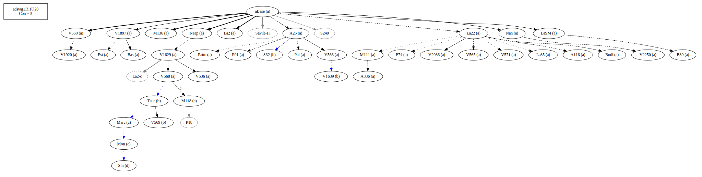
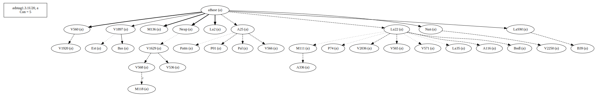
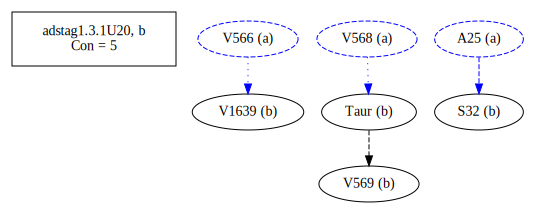
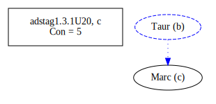
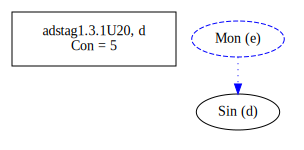
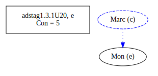
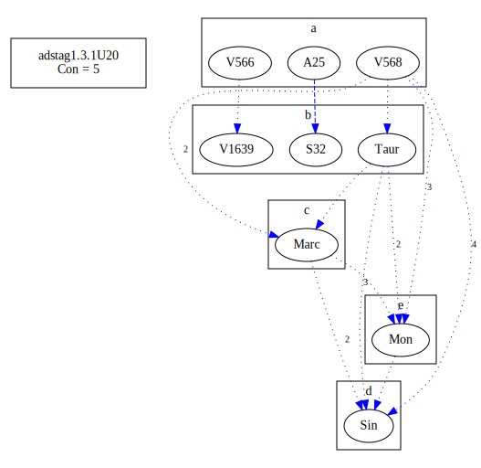
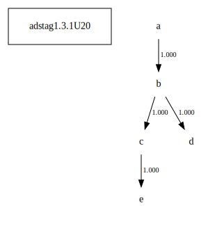

# Variant Analysis: AdStag1.x.x

## 📌 Variant Description
- **Variant unit**: adstag1.x.x

- **Variant Units**: 
  - Reading A: ἐκείνῳ
  - Reading B: ἐκείνων
  - Reading C: οἰκείνῳ
  - Reading D: οἰκείνων
  - Reading E: οἰκείων

## 🧬 Manuscript Support
| Reading | Manuscripts | Notes |
|--------|-------------|-------|
| A      | P74 V1897 V2250 Pal A25 Bas La35 LaSM La2 Patm M118 P01 V565 V560 M136 Neap A336 A116 V1920 V2036 Nan M111 V566 V568 V536 Bodl V571 V1629 B39 Est La22 |  |
| B      | V1639 S32 V569 Taur |  |
| C      | Marc |  |
| D      | Sin |  |
| E      | Mon  |  |
## 🧠 Internal Evidence
- **Transcriptional Probability**: [e.g., Reading A is shorter and more difficult]
- **Stylistic/Contextual Fit**: [e.g., Reading B aligns with second sophistic style]

## 🧭 External Evidence
- **Manuscript Age**: [e.g., Reading A supported by earlier MSS]
- **Geographical Spread**: []

## 🔄 Directionality & Genealogy
- **Likely Original Reading**: [e.g., Reading A]
  - [e.g., B likely derived from A via harmonization]
  - [e.g., C appears to be a conflation of A and B]
## open-cbgm textual flow ##

## open-cbgm attestations ##

## open-cbgm flow limited to variant readings ##

## Local stemma ##

- **Contamination Notes**: [e.g., Manuscript F shows mixture of A and B]

## 📝 Notes & Decisions
- [Any additional observations, uncertainties, or decisions made]

---