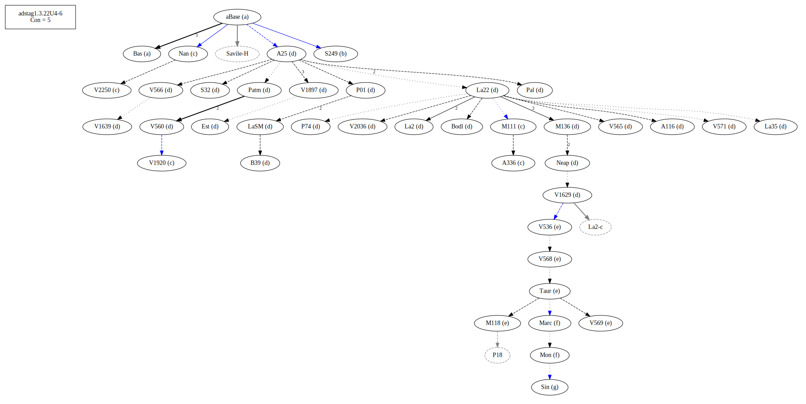
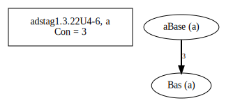
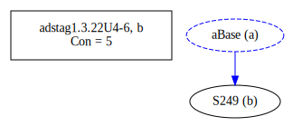
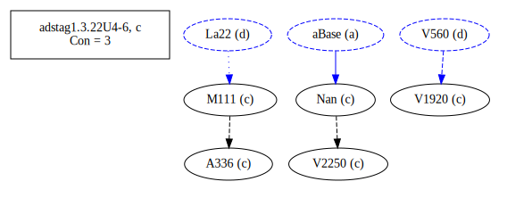
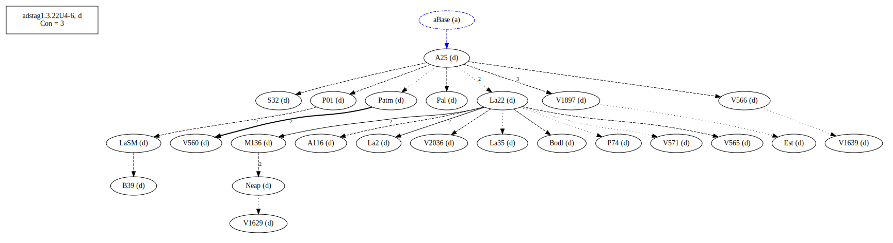
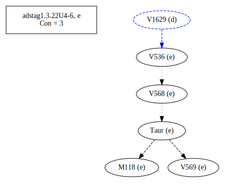
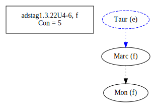
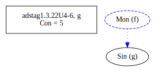
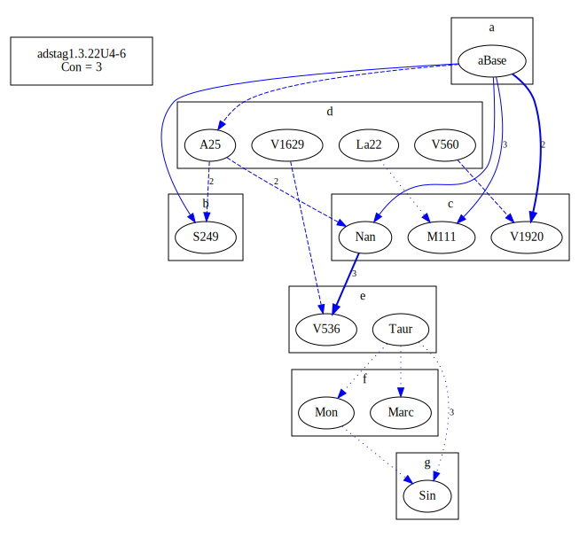
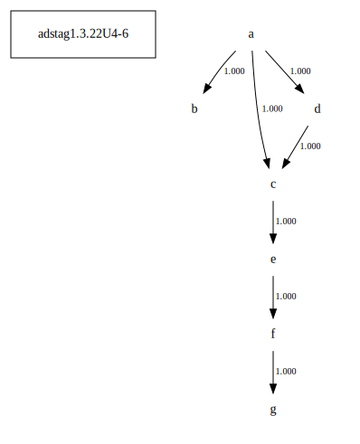

# Variant Analysis: AdStag1.3.22/4-6

## 📌 Variant Description
- **Variant unit**: adstag1.3.22/4-6

- **Variant Units**: 
  - Reading A: περὶ αὐτοῦ
  - Reading B: περὶ ἑαυτοῦ
  - Reading C: περὶ αὐτοῦ δὲ
  - Reading D: περὶ ἑαυτοῦ δὲ
  - Reading E: περὶ αὐτοῦ τούτου καὶ
  - Reading F: περὶ αὐτοῦ τούτου
  - Reading G: περἰ ἑαυτοῦ

## 🧬 Manuscript Support
| Reading | Manuscripts | Notes |
|--------|-------------|-------|
| A      | Bas |  |
| B      | S249 |  |
| C      | V2250 A336 V1920 Nan M111 |  |
| D      | P74 V1897 Pal A25 La35 LaSM La2 Patm V1639 P01 V565 V560 S32 M136 Neap A116 V2036 V566 V1920-c Bodl V571 V1629 B39 Est La22 |  |
| E      | M118 V568 V536 V569 Taur |  |
| F      | Mon Marc |  |
| G      | Sin |  |

## 🧠 Internal Evidence
- **Transcriptional Probability**: [e.g., Reading A is shorter and more difficult]
- **Stylistic/Contextual Fit**: [e.g., Reading B aligns with second sophistic style]

## 🧭 External Evidence
- **Manuscript Age**: [e.g., Reading A supported by earlier MSS]
- **Geographical Spread**: []

## 🔄 Directionality & Genealogy
- **Likely Original Reading**: [e.g., Reading A]
  - [e.g., B likely derived from A via harmonization]
  - [e.g., C appears to be a conflation of A and B]
## open-cbgm textual flow ##

## open-cbgm textual flow ##

## open-cbgm textual flow ##

## open-cbgm attestations ##

## open-cbgm flow limited to variant readings ##

## Local stemma ##

- **Contamination Notes**: [e.g., Manuscript F shows mixture of A and B]

## 📝 Notes & Decisions
- [Any additional observations, uncertainties, or decisions made]

---