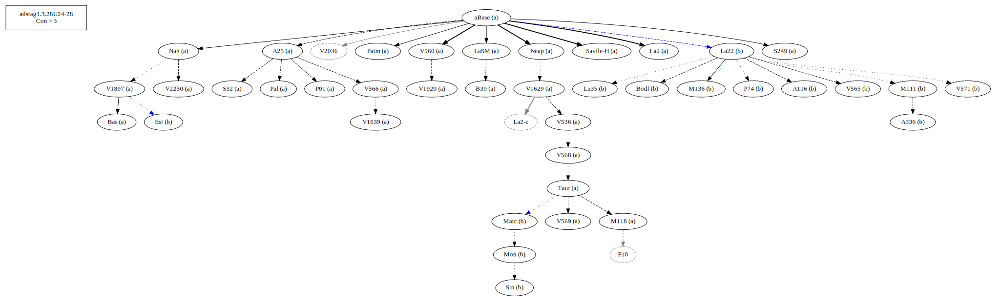
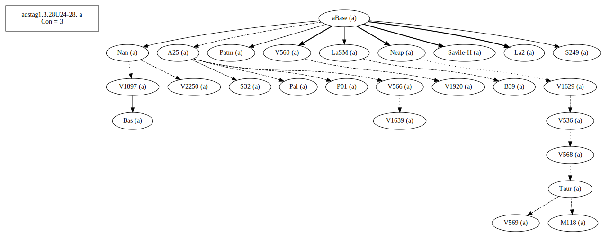
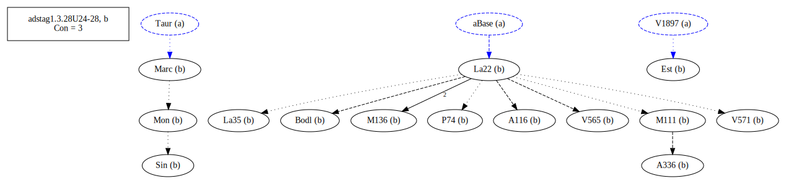
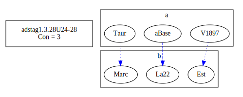
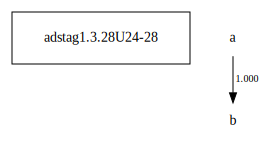

# Variant Analysis: AdStag1.x.x

## 📌 Variant Description
- **Variant unit**: adstag1.x.x

- **Variant Units**: 
  - Reading A: κελεύει τοῦτο ποιεῖν
  - Reading B: τοῦτο κελεύει ποιεῖν

## 🧬 Manuscript Support
| Reading | Manuscripts | Notes |
|--------|-------------|-------|
| A      | All but B | A25, Savile |
| B      | P74 La35 V565 M136 Sin A336 A116 M111 Bodl V571 Mon Est Marc La22 | La22, Migne  |

## 🧠 Internal Evidence
- **Transcriptional Probability**: [e.g., Reading A is shorter and more difficult]
- **Stylistic/Contextual Fit**: [e.g., Reading B aligns with second sophistic style]

## 🧭 External Evidence
- **Manuscript Age**: [e.g., Reading A supported by earlier MSS]
- **Geographical Spread**: []

## 🔄 Directionality & Genealogy
- **Likely Original Reading**: [e.g., Reading A]
  - [e.g., B likely derived from A via harmonization]
  - [e.g., C appears to be a conflation of A and B]
  
## open-cbgm textual flow ##

## open-cbgm attestations ##
   
   
## open-cbgm flow limited to variant readings ##

## Local stemma ##

- **Contamination Notes**: [e.g., Manuscript F shows mixture of A and B]

## 📝 Notes & Decisions
- [Any additional observations, uncertainties, or decisions made]

---