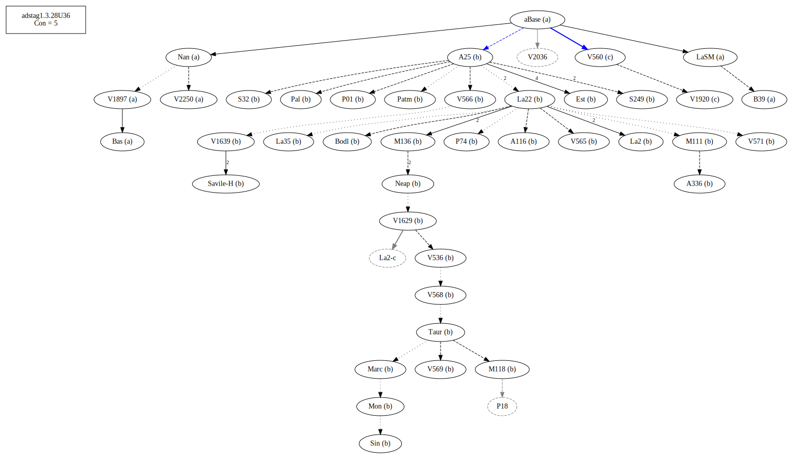
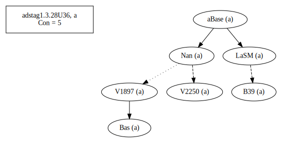
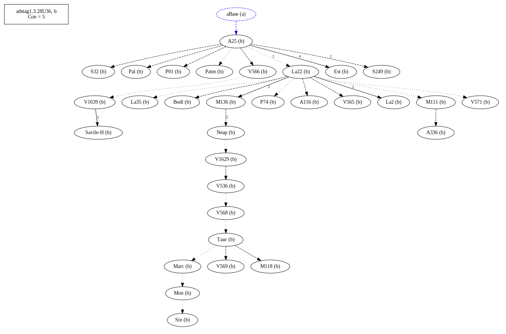
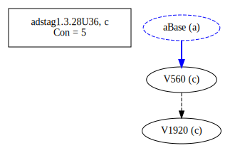
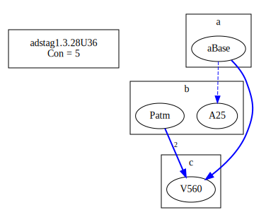
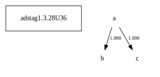

# Variant Analysis: AdStag1.3.28/36

## 📌 Variant Description
- **Location**: adstag1.3.28/36
- **Variant Units**: 
  - Reading A: ἐνῆν
  - Reading B: ἐνὸν
  - Reading C: ἐῶν

## 🧬 Manuscript Support
| Reading | Manuscripts | Notes |
|--------|-------------|-------|
| A      | B39 Bas LaSM Nan V1897 V2250 | Bas et al. |
| B      | A116 A25 A336 Bodl Est La2 La22 La35 M111 M118 M136 Marc Mon Neap P01 P74 Pal Patm S249 S32 Sin Taur V1629 V1639 V536 V565 V566 V568 V569 V571    | Most |
| C      | V1920 V560      | The pair |

## 🧠 Internal Evidence
- **Transcriptional Probability**: [e.g., Reading A is shorter and more difficult]
- **Stylistic/Contextual Fit**: [e.g., Reading B aligns with second sophistic style]

## 🧭 External Evidence
- **Manuscript Age**: [e.g., Reading A supported by earlier MSS]
- **Geographical Spread**: []

## 🔄 Directionality & Genealogy
- **Likely Original Reading**: [e.g., Reading A]
- **Genealogical Relationships**:
  - [e.g., B likely derived from A via harmonization]
  - [e.g., C appears to be a conflation of A and B]
## open-cbgm textual flow ##

## open-cbgm attestations ##

## open-cbgm flow limited to variant readings ##

## Local stemma ##

- **Contamination Notes**: [e.g., Manuscript F shows mixture of A and B]

## 📝 Notes & Decisions
- Bas and other old mss tipped the scale.

---