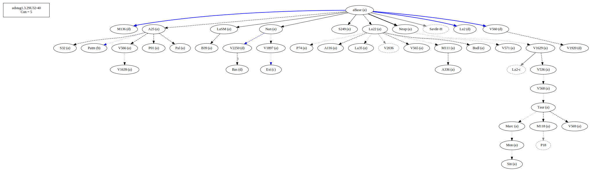
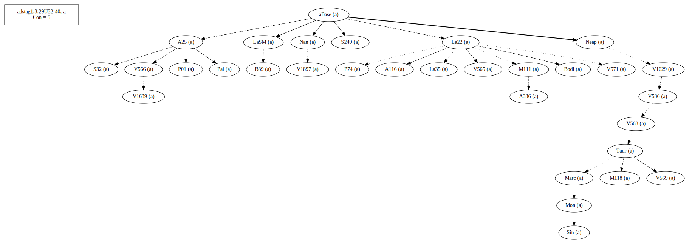
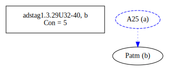
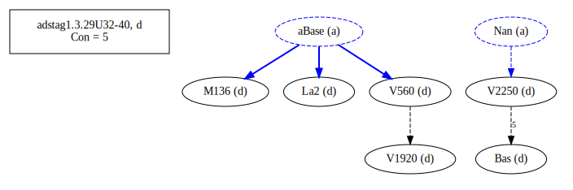
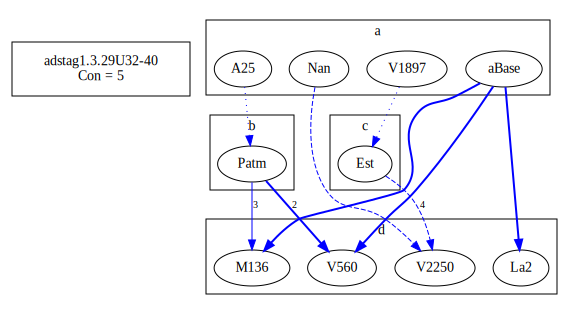
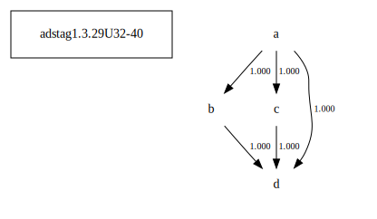

# Variant Analysis: AdStag1.3.29/32-40

## 📌 Variant Description
- **Location**: adstag1.3.29/32-40
- **Variant Units**: 
  - Reading A: τὴν κηδεμονίαν τοῦ θεοῦ ἡμῖν
  - Reading B: τὴν κηδεμονίαν ἡμῖν τοῦ θεοῦ
  - Reading C: τοῦ θεοῦ τὴν κηδεμονίαν ἡμῖν
  - Reading D: τὴν κηδεμονίαν ἡμιν

## 🧬 Manuscript Support
| Reading | Manuscripts | Notes |
|--------|-------------|-------|
| A      | A116 A25 A336 B39 Bodl La22 La35 LaSM M111 M118 Marc Mon Nan Neap P01 P74 Pal S249 S32 Sin Taur V1629 V1639 V1897 V536 V565 V566 V568 V569 V571 | most, editions |
| B      | Patm    | lone |
| C      | Bas La2 M136 V1920 V2250 V560 | Bas and V560 et al (old) |
| D      | Est | lone |

## 🧠 Internal Evidence
- **Transcriptional Probability**: [e.g., Reading A is shorter and more difficult]
- **Stylistic/Contextual Fit**: [e.g., Reading B aligns with second sophistic style]

## 🧭 External Evidence
- **Manuscript Age**: [e.g., Reading A supported by earlier MSS]
- **Geographical Spread**: []

## 🔄 Directionality & Genealogy
- **Likely Original Reading**: [e.g., Reading A]
- **Genealogical Relationships**:
  - [e.g., B likely derived from A via harmonization]
  - [e.g., C appears to be a conflation of A and B]
## open-cbgm textual flow ##

## open-cbgm attestations ##
   
   
   
   
## open-cbgm flow limited to variant readings ##

## Local stemma ##

- **Contamination Notes**: [e.g., Manuscript F shows mixture of A and B]

## 📝 Notes & Decisions
- Even though Bas, La2 and V560 agree, all readings are best explained by A

---