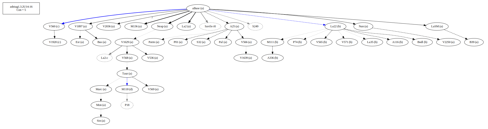
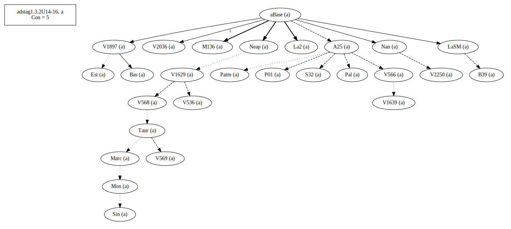
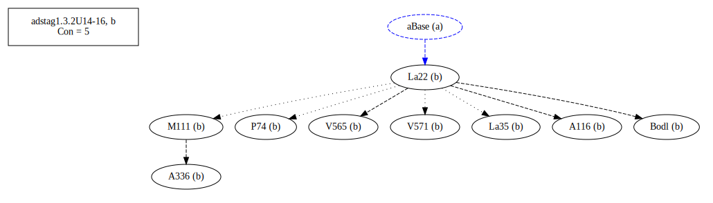
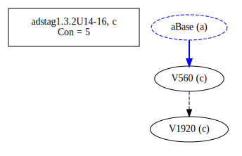
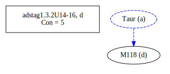
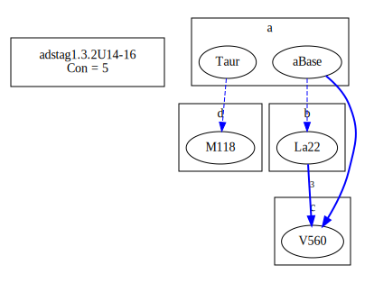
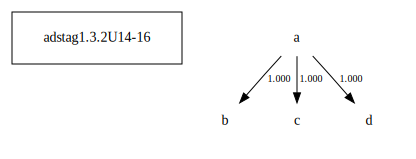

# Variant Analysis: AdStag1.3.2/14-16

## 📌 Variant Description
- **Variant unit**: adstag1.3.2/14-16

- **Variant Units**: 
  - Reading A: ἂν ἔπαθεν
  - Reading B: ἔπαθεν ἄν
  - Reading C: ὦν ἔπαθεν
  - Reading D: ἔπαθεν

## 🧬 Manuscript Support
| Reading | Manuscripts | Notes |
|--------|-------------|-------|
| A      | V1897 V2250 Pal A25 Bas LaSM La2 Patm V1639 P01 S32 M136 Sin Neap V2036 Nan V566 V568 V536 Mon V1629 V569 B39 Est Marc Taur | Most, Savile |
| B      | P74 La35 V565 A336 A116 M111 Bodl V571 La22 | P74 La22 M111 Migne |
| C      | V560 V1920  |  |
| D      | M118  |  |

## 🧠 Internal Evidence
- **Transcriptional Probability**: [e.g., Reading A is shorter and more difficult]
- **Stylistic/Contextual Fit**: [e.g., Reading B aligns with second sophistic style]

## 🧭 External Evidence
- **Manuscript Age**: [e.g., Reading A supported by earlier MSS]
- **Geographical Spread**: []

## 🔄 Directionality & Genealogy
- **Likely Original Reading**: [e.g., Reading A]
  - [e.g., B likely derived from A via harmonization]
  - [e.g., C appears to be a conflation of A and B]
## open-cbgm textual flow ##

## open-cbgm attestations ##

## open-cbgm flow limited to variant readings ##

## Local stemma ##

- **Contamination Notes**: [e.g., Manuscript F shows mixture of A and B]

## 📝 Notes & Decisions
- [Any additional observations, uncertainties, or decisions made]

---