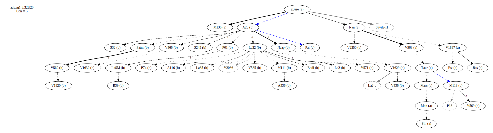
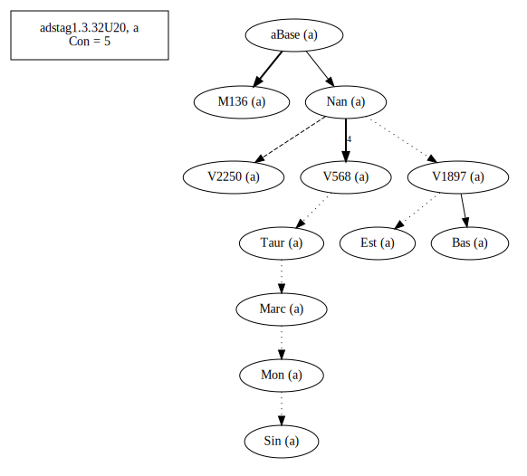
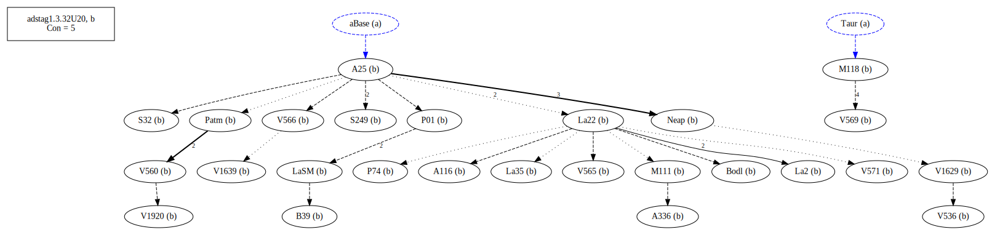
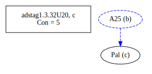
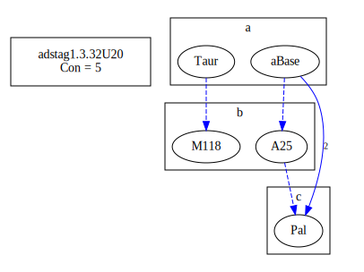

# Variant Analysis: AdStag1.3.32/20

Choice of preposition split between the oldest.

## 📌 Variant Description
- **Location**: adstag1.3.32/20
- **Variant Units**: 
  - Reading A: (προτέψαι) πρὸς (ἀρετὴν)
  - Reading B: (προτέψαι) εἰς (ἀρετὴν)
  - Reading C: (προτέψαι) τὴν ἀρετὴν

## 🧬 Manuscript Support
| Reading | Manuscripts | Notes |
|--------|-------------|-------|
| A      | A116 A25 A336 B39 Bodl La2 La22 La35 LaSM M111 M118 Neap P01 P74 Patm S249 S32 V1629 V1639 V1920 V536 V560 V565 V566 V569 V571 | Most, Migne |
| B      | Bas Est M136 Marc Mon Nan Sin Taur V1897 V2250 V568    | Bas Nan Savile |
| C      | Pal       | lone |

LSJ II folld. by a Prep., εἰς, ἐπὶ Pl, Isoc. πρὸς Pl. : ἐπ΄ ἀρετὴν Isoc. others.

εἰς ἐπὶ seems to be followed by substantives, πρὸς by τὸ + inf. (Pl.)

## 🧠 Internal Evidence
- **Transcriptional Probability**: [e.g., Reading A is shorter and more difficult]
- **Stylistic/Contextual Fit**: [e.g., Reading B aligns with second sophistic style]

## 🧭 External Evidence
- **Manuscript Age**: [e.g., Reading A supported by earlier MSS]
- **Geographical Spread**: []

## 🔄 Directionality & Genealogy
- **Likely Original Reading**: [e.g., Reading A]
- **Genealogical Relationships**:
  - [e.g., B likely derived from A via harmonization]
  - [e.g., C appears to be a conflation of A and B]
## open-cbgm textual flow ##

## open-cbgm attestations ##

## open-cbgm flow limited to variant readings ##

## Local stemma ##

- **Contamination Notes**: [e.g., Manuscript F shows mixture of A and B]

## 📝 Notes & Decisions
- Decided on εἰς with the substantive. The whole passage is difficult to translate.

---