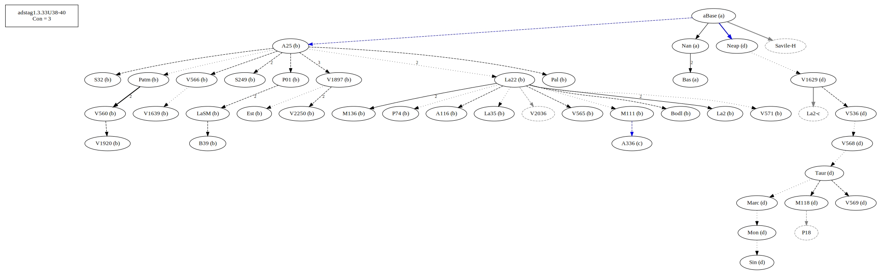
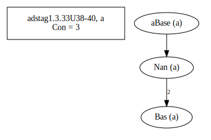
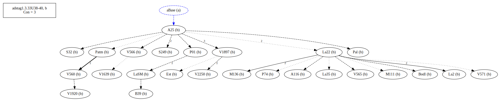
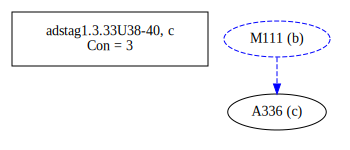
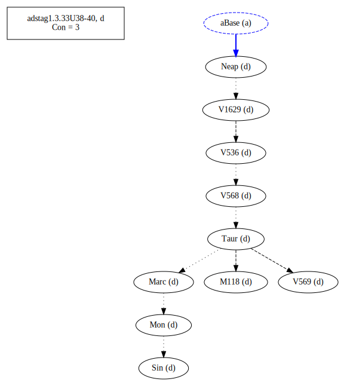
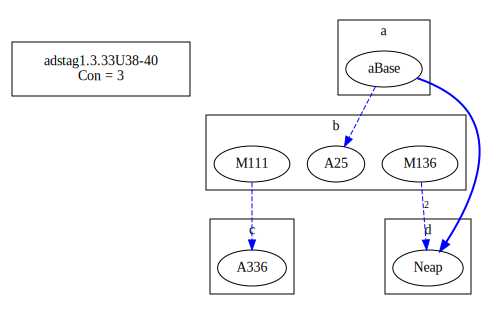
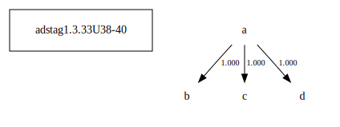

# Variant Analysis: AdStag1.3.33/38-40

## 📌 Variant Description
- **Location**: adstag1.3.33/38-40
- **Variant Units**: 
  - Reading B: εἴπερ ἔμενεν
  - Reading C: εἴπερ ἔμεινεν
  - Reading A: εἰ παρέμενεν
  - Reading D: εἰ ἔμενεν

## 🧬 Manuscript Support
| Reading | Manuscripts | Notes |
|--------|-------------|-------|
| B      | A116 A25 B39 Bodl Est La2 La22 La35 LaSM M111 M136 P01 P74 Pal Patm S249 S32 V1639 V1897 V1920 V2250 V560 V565 V566 V571 | Many old, Savile, Migne |
| C      | A336    | lone |
| A      | Bas Nan | Two of the oldest |
| D      | M118 Marc Mon Neap Sin Taur V1629 V536 V568 V569 | Taur-group |

## 🧠 Internal Evidence
- **Transcriptional Probability**: [e.g., Reading A is shorter and more difficult]
- **Stylistic/Contextual Fit**: [e.g., Reading B aligns with second sophistic style]

## 🧭 External Evidence
- **Manuscript Age**: [e.g., Reading A supported by earlier MSS]
- **Geographical Spread**: []

## 🔄 Directionality & Genealogy
- **Likely Original Reading**: [e.g., Reading A]
- **Genealogical Relationships**:
  - [e.g., B likely derived from A via harmonization]
  - [e.g., C appears to be a conflation of A and B]
## open-cbgm textual flow ##

## open-cbgm attestations ##
   
   
   
   
## open-cbgm flow limited to variant readings ##

## Local stemma ##

- **Contamination Notes**: [e.g., Manuscript F shows mixture of A and B]

## 📝 Notes & Decisions
- Very possible that C led to A and B. One could also consider the other way around.

---