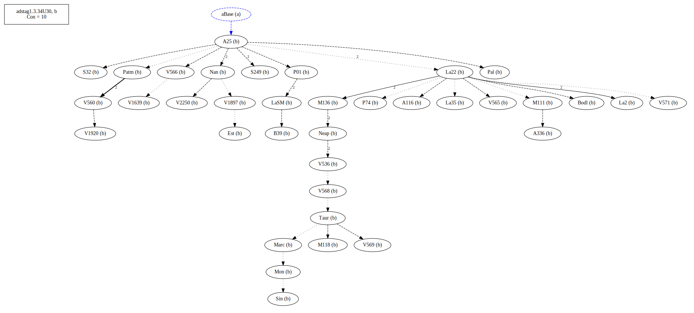
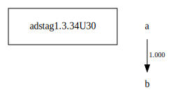

# Variant Analysis: AdStag1.3.34U30

Might be a case where Bas has the correct reading against most others.

## 📌 Variant Description
- **Location**: [AdStag1.3.34U30]
- **Variant Units**: 
  - Reading A: στρεφόμενος
  - Reading B: τρεφόμενος

## 🧬 Manuscript Support
| Reading | Manuscripts | Notes |
|--------|-------------|-------|
| A      | V1897. V2250. Savile. Pal. A25. La35. LaSM. La2. Patm. S249. V1639. M118. P01. V565. V560. S32. M136. Sin. Neap. A336. A116. V1920. Base. Nan. M111. V566. V568. aBase. La22-c. V536. Bodl. V571. Mon. V569. B39. Est. Marc. Taur. La22. | most |
| B      | Bas. V1629    | [charactarization] |

## 🧠 Internal Evidence
- **Transcriptional Probability**: Reading a is what might have felt more logical in the narrative
- **Stylistic/Contextual Fit**: Reading b fits with the preposition ἐν παραδείσῳ

## 🔄 Directionality & Genealogy
- **Likely Original Reading**: [e.g., Reading A]
- **Genealogical Relationships**:
  - [e.g., B likely derived from A via harmonization]
  - [e.g., C appears to be a conflation of A and B]
## open-cbgm textual flow ##

## open-cbgm attestations ##

## open-cbgm flow limited to variant readings ##

## Local stemma ##

- **Contamination Notes**: [e.g., Manuscript F shows mixture of A and B]

## 📝 Notes & Decisions
- [Any additional observations, uncertainties, or decisions made]

---
