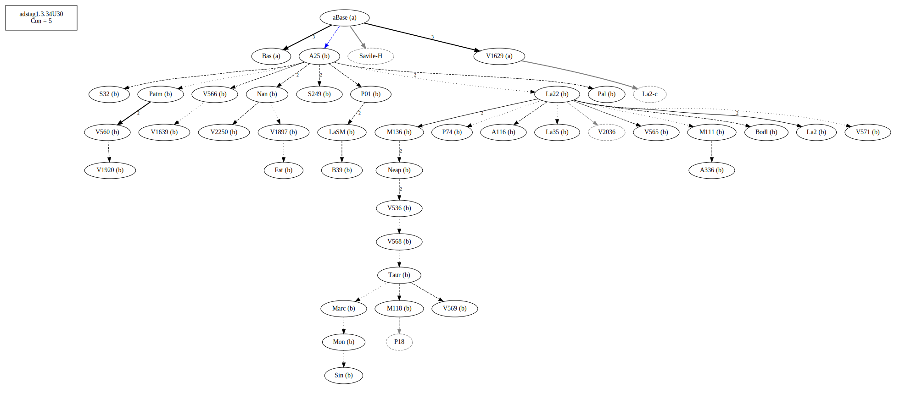
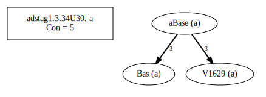
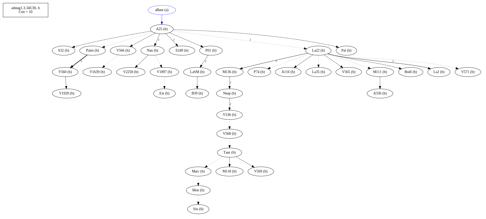
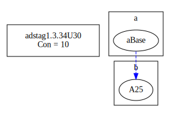
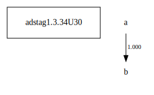

# Variant Analysis: AdStag1.3.36U64

## 📌 Variant Description
- **Location**: AdStag1.3.36U64
- **Variant Units**: 
  - Reading A: δὴ
  - Reading B: omit

## 🧬 Manuscript Support
| Reading | Manuscripts | Notes |
|--------|-------------|-------|
| A      | V2250. Savile. Pal. A25. Bas. Patm. V1639. P01. V560. Neap. A336. A116. Base. Nan. aBase. Bodl. V571. V569. | A25, editions  |
| B      | V1897. La35. LaSM. La2. S249. M118. V565. S32. M136. Sin. V1920. M111. V566. V568. V536. Mon. V1629. B39. Est. Marc. Taur. La22.    | La22 |

## 🧠 Internal Evidence
- **Transcriptional Probability**: [e.g., Reading A is shorter and more difficult]
- **Stylistic/Contextual Fit**: [e.g., Reading B aligns with second sophistic style]

## 🧭 External Evidence
- **Manuscript Age**: [e.g., Reading A supported by earlier MSS]
- **Geographical Spread**: []

## 🔄 Directionality & Genealogy
- **Likely Original Reading**: [e.g., Reading A]
- **Genealogical Relationships**:
  - [e.g., B likely derived from A via harmonization]
  - [e.g., C appears to be a conflation of A and B]
## open-cbgm textual flow ##

## open-cbgm attestations ##

## open-cbgm flow limited to variant readings ##

## Local stemma ##

- **Contamination Notes**: [e.g., Manuscript F shows mixture of A and B]

## 📝 Notes & Decisions
- Affects the relationship between Neap and V1629

---
