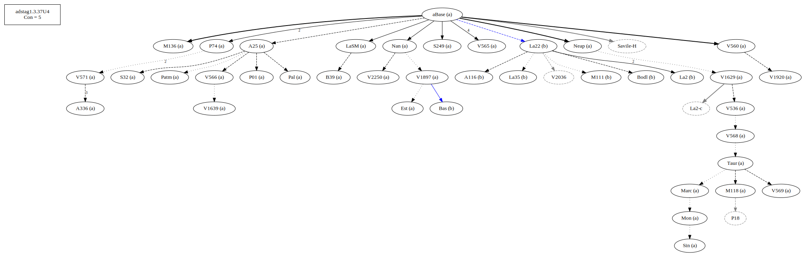

# Variant Analysis: AdStag1.3.37/2-4

## 📌 Variant Description
- **Location**: adstag1.3.37/2-4
- **Variant Units**: 
  - Reading A: καίτοι καὶ
  - Reading B: καἰτοι

## 🧬 Manuscript Support
| Reading | Manuscripts | Notes |
|--------|-------------|-------|
| A      | A25 A336 B39 Est LaSM M118 M136 Marc Mon Nan Neap P01 P74 Pal Patm S249 S32 Sin Taur V1629 V1639 V1897 V1920 V2250 V536 V560 V565 V566 V568 V569 V571| A25 not La22 Nan V560 Taur-group |
| B      | A116 Bas Bodl La2 La22 La35 M111| Bas La22 and good mss|

## 🧠 Internal Evidence
- **Transcriptional Probability**: [e.g., Reading A is shorter and more difficult]
- **Stylistic/Contextual Fit**: [e.g., Reading B aligns with second sophistic style]

## 🧭 External Evidence
- **Manuscript Age**: [e.g., Reading A supported by earlier MSS]
- **Geographical Spread**: []

## 🔄 Directionality & Genealogy
- **Likely Original Reading**: [e.g., Reading A]
- **Genealogical Relationships**:
  - [e.g., B likely derived from A via harmonization]
  - [e.g., C appears to be a conflation of A and B]
## open-cbgm textual flow ##

## open-cbgm attestations ##

## open-cbgm flow limited to variant readings ##

## Local stemma ##

- **Contamination Notes**: [e.g., Manuscript F shows mixture of A and B]

## 📝 Notes & Decisions
- [Any additional observations, uncertainties, or decisions made]

---