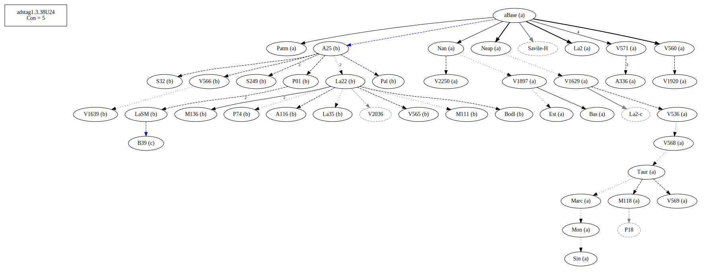
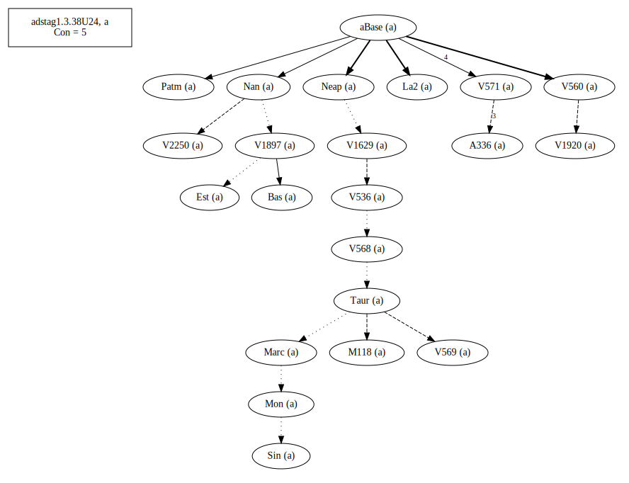
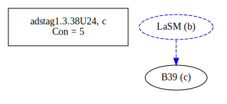
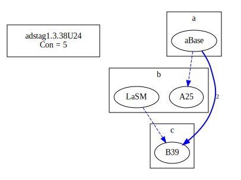
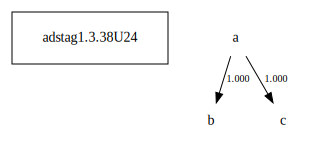

# Variant Analysis: AdStag1.3.38/24

## 📌 Variant Description
- **Variant unit**: adstag1.3.38/24

- **Variant Units**: 
  - Reading A: φυλάττῃ
  - Reading B: φυλάττοι
  - Reading C: φυλάτοιεν

## 🧬 Manuscript Support
| Reading | Manuscripts | Notes |
|--------|-------------|-------|
| A      | V1897 V2250 Bas La2 Patm M118 V560 Sin Neap A336 V1920 Nan V568 V536 V571 Mon V1629 V569 Est Marc Taur | Migne |
| B      | P74 Pal A25 La35 LaSM S249 V1639 P01 V565 S32 M136 A116 M111 V566 Bodl La22 | Savile |
| C      | B39 |  |

## 🧠 Internal Evidence
- **Transcriptional Probability**: [e.g., Reading A is shorter and more difficult]
- **Stylistic/Contextual Fit**: [e.g., Reading B aligns with second sophistic style]

## 🧭 External Evidence
- **Manuscript Age**: [e.g., Reading A supported by earlier MSS]
- **Geographical Spread**: []

## 🔄 Directionality & Genealogy
- **Likely Original Reading**: [e.g., Reading A]
  - [e.g., B likely derived from A via harmonization]
  - [e.g., C appears to be a conflation of A and B]
## open-cbgm textual flow ##

## open-cbgm attestations ##

## open-cbgm flow limited to variant readings ##

## Local stemma ##

- **Contamination Notes**: [e.g., Manuscript F shows mixture of A and B]

## 📝 Notes & Decisions
- [Any additional observations, uncertainties, or decisions made]

---