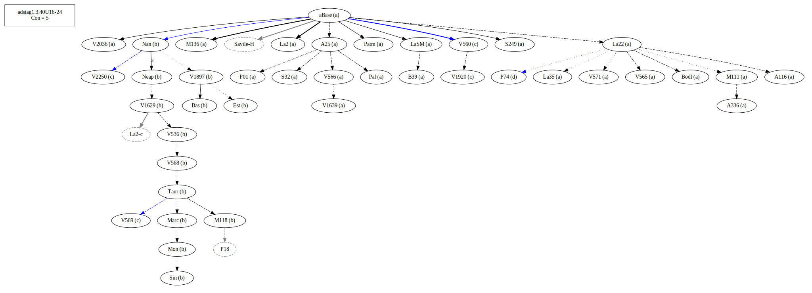
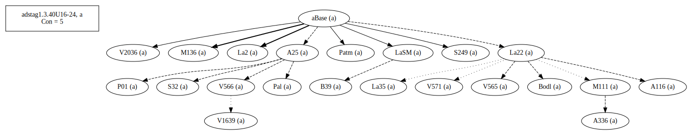
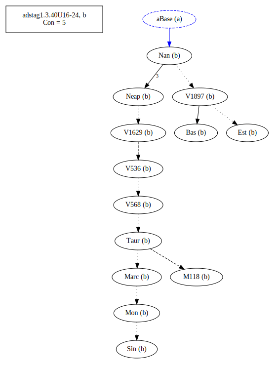
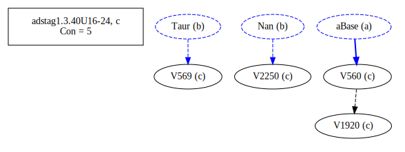
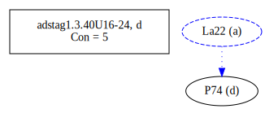
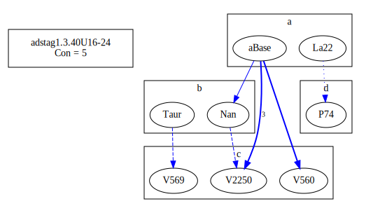

# Variant Analysis: AdStag1.3.40/16-24

## 📌 Variant Description
- **Location**: adstag1.3.40/16-24
- **Variant Units**: 
  - Reading A: τῆς καλίστης ταύτης μεταβολῆς ἦν
  - Reading B: ἦν τῆς καλίστης ταὐτης μεταβολῆς
  - Reading C: τῆς καλίστης ταύτης μεταβολῆς
  - Reading D: τῆς καλῆς ταύτης μεταβολῆς

## 🧬 Manuscript Support
| Reading | Manuscripts | Notes |
|--------|-------------|-------|
| A      | Pal A25 La35 LaSM La2 Patm S249 V1639 P01 V565 S32 M136 A336 A116 V2036 M111 V566 Bodl V571 B39 La22 | Most, editions |
| B      | V1897 Bas M118 Sin Neap Nan V568 V536 Mon V1629 Est Marc Taur| Bas Nan Taur-group |
| C      | V2250 V560 V1920 V569| [lone] |
| D      | P74 ||

## 🧠 Internal Evidence
- **Transcriptional Probability**: [e.g., Reading A is shorter and more difficult]
- **Stylistic/Contextual Fit**: [e.g., Reading B aligns with second sophistic style]

## 🧭 External Evidence
- **Manuscript Age**: [e.g., Reading A supported by earlier MSS]
- **Geographical Spread**: []

## 🔄 Directionality & Genealogy
- **Likely Original Reading**: [e.g., Reading A]
- **Genealogical Relationships**:
  - [e.g., B likely derived from A via harmonization]
  - [e.g., C appears to be a conflation of A and B]
## open-cbgm textual flow ##

## open-cbgm attestations ##
   
   
   
   
## open-cbgm flow limited to variant readings ##

## Local stemma ##

- **Contamination Notes**: [e.g., Manuscript F shows mixture of A and B]

## 📝 Notes & Decisions
- [Any additional observations, uncertainties, or decisions made]

---