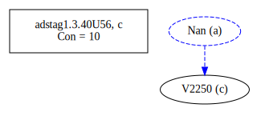

# Variant Analysis: AdStag1.3.40/56

## 📌 Variant Description
- **Variant unit**: adstag1.3.40/56

- **Variant Units**: 
  - Reading A: ἀπέδειξε
  - Reading B: ἐπέδειξε
  - Reading C: ἔδειξε

## 🧬 Manuscript Support
| Reading | Manuscripts | Notes |
|--------|-------------|-------|
| A      | P74 V1897 Pal A25 Bas La35 LaSM La2 Patm M118 P01 V565 S32 M136 Sin Neap A336 A116 V1920 V2036 Nan M111 V568 Bodl V571 Mon B39 Marc La22 | Most, editions |
| B      | S249 V1639 V560 V566 V536 V1629 V569 Est Taur | Taur-group |
| C      | V2250 |  |

## 🧠 Internal Evidence
- **Transcriptional Probability**: [e.g., Reading A is shorter and more difficult]
- **Stylistic/Contextual Fit**: [e.g., Reading B aligns with second sophistic style]

## 🧭 External Evidence
- **Manuscript Age**: [e.g., Reading A supported by earlier MSS]
- **Geographical Spread**: []

## 🔄 Directionality & Genealogy
- **Likely Original Reading**: [e.g., Reading A]
  - [e.g., B likely derived from A via harmonization]
  - [e.g., C appears to be a conflation of A and B]
## open-cbgm textual flow ##

## open-cbgm attestations ##

## open-cbgm flow limited to variant readings ##

## Local stemma ##

a->b a->c
- **Contamination Notes**: [e.g., Manuscript F shows mixture of A and B]

## 📝 Notes & Decisions
- [Any additional observations, uncertainties, or decisions made]

---