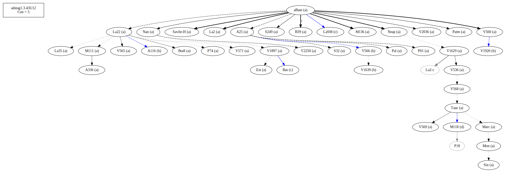
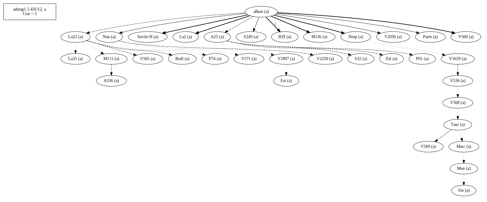
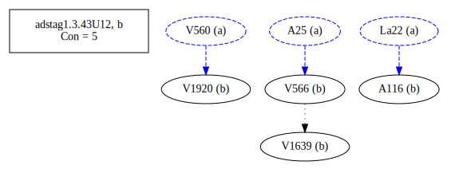
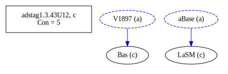
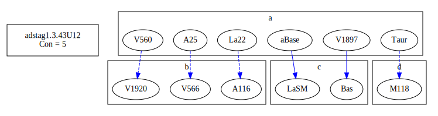

# Variant Analysis: AdStag1.3.43/12

## 📌 Variant Description
- **Variant unit**: adstag1.3.43/12

- **Variant Units**: 
  - Reading A: οἷ
  - Reading B: ὃ
  - Reading C: οἷον
  - Reading D: οὗ

## 🧬 Manuscript Support
| Reading | Manuscripts | Notes |
|--------|-------------|-------|
| A      | All besides below | Savile, Migne |
| B      | V1639 A116 V1920 V566 |  |
| C      | Bas LaSM |  |
| D | M118 ||

## 🧠 Internal Evidence
- **Transcriptional Probability**: [e.g., Reading A is shorter and more difficult]
- **Stylistic/Contextual Fit**: [e.g., Reading B aligns with second sophistic style]

## 🧭 External Evidence
- **Manuscript Age**: [e.g., Reading A supported by earlier MSS]
- **Geographical Spread**: []

## 🔄 Directionality & Genealogy
- **Likely Original Reading**: [e.g., Reading A]
  - [e.g., B likely derived from A via harmonization]
  - [e.g., C appears to be a conflation of A and B]
  
## open-cbgm textual flow ##

## open-cbgm attestations ##

## open-cbgm flow limited to variant readings ##

## Local stemma ##

- **Contamination Notes**: [e.g., Manuscript F shows mixture of A and B]

## 📝 Notes & Decisions
- [Any additional observations, uncertainties, or decisions made]

---