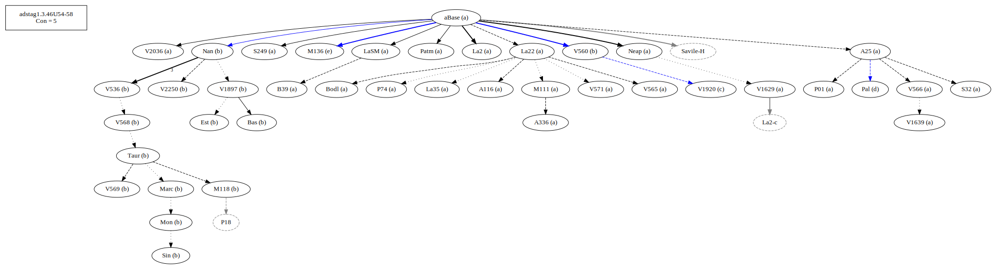
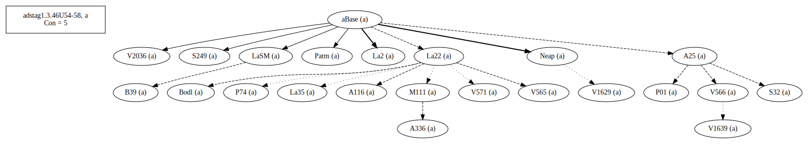
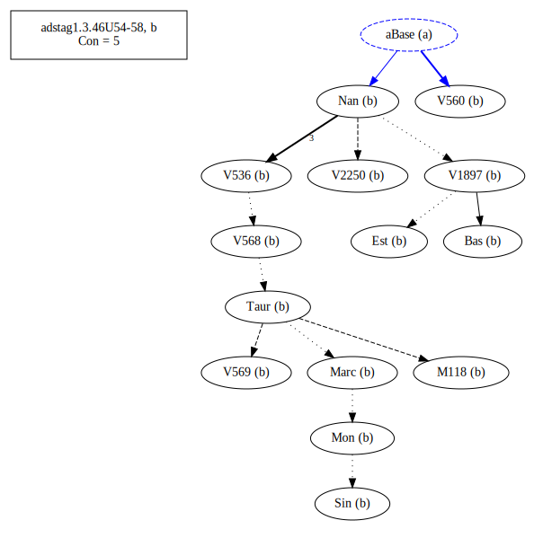
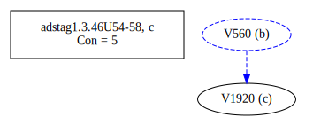
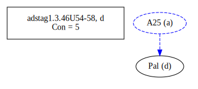
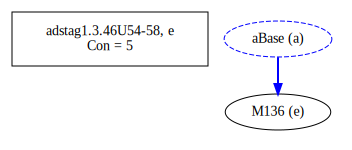
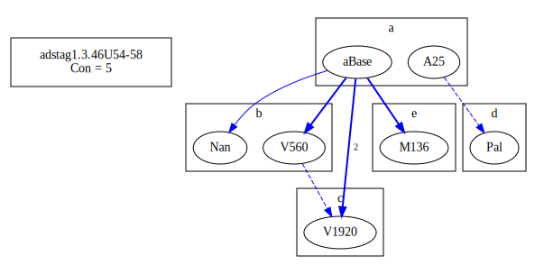
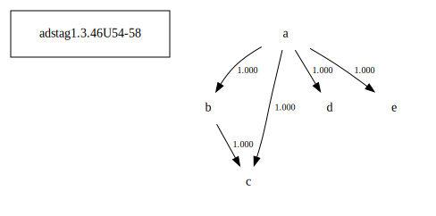

# Variant Analysis: AdStag1.3.46/54-58

## 📌 Variant Description
- **Location**: adstag1.3.46/54-58
- **Variant Units**: 
  - Reading A: πρὸς μετάνοιαν ἄγων
  - Reading B: εἰς μετάνοιαν ἄγων
  - Reading C: καὶ πρὸς μετάνοιαν ἄγων
  - Reading D: πρὸς δὲ καὶ εἰς μετάνοιαν ἄγων
  - Reading E: πρὀς δὲ τούτοις καὶ εἰς μετάνοιαν ἄγων 

## 🧬 Manuscript Support
| Reading | Manuscripts | Notes |
|--------|-------------|-------|
| A      | A116 A25 A336 B39 Bodl La2 La22 La35 LaSM M111 Neap P01 P74 Patm S249 S32 V1629 V1639 V2036 V565 V566 V571| A25 La22  |
| B      | V1920 | lone |
| C      | Pal | lone |
| D      | Bas Est M118 Marc Mon Nan Sin Taur V1897 V2250 V536 V560 V568 V569 | Bas Nan V560 Taur-group, editions|
| E | M136 | lone |

## 🧠 Internal Evidence
- **Transcriptional Probability**: [e.g., Reading A is shorter and more difficult]
- **Stylistic/Contextual Fit**: [e.g., Reading B aligns with second sophistic style]

## 🧭 External Evidence
- **Manuscript Age**: [e.g., Reading A supported by earlier MSS]
- **Geographical Spread**: []

## 🔄 Directionality & Genealogy
- **Likely Original Reading**: [e.g., Reading A]
- **Genealogical Relationships**:
  - [e.g., B likely derived from A via harmonization]
  - [e.g., C appears to be a conflation of A and B]
## open-cbgm textual flow ##

## open-cbgm attestations ##
   
   
   
   
   
## open-cbgm flow limited to variant readings ##

## Local stemma ##

- **Contamination Notes**: [e.g., Manuscript F shows mixture of A and B]

## 📝 Notes & Decisions
- Bas and editions is probably correct.

---