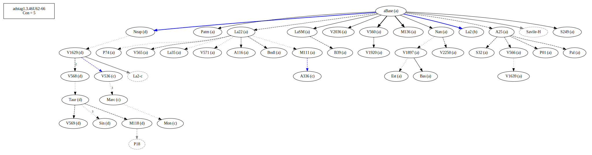
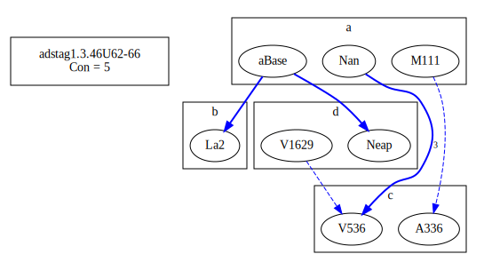

# Variant Analysis: AdStag1.3.46/62-66

## 📌 Variant Description
- **Variant unit**: adstag1.3.46/62-66

- **Variant Units**: 
  - Reading A: τῆς χρηστότητος αὐτοῦ
  - Reading B: τὴν χρηστότητα την αὐτοῦ
  - Reading C: τῆς τοιαύτης χρηστότητος αὐτοῦ
  - Reading D: τῆς τοιαύτης χρηστότητος

## 🧬 Manuscript Support
| Reading | Manuscripts | Notes |
|--------|-------------|-------|
| A      | P74 V1897 V2250 Pal A25 Bas La35 LaSM Patm S249 V1639 P01 V565 V560 S32 M136 A116 V1920 V2036 Nan M111 V566 Bodl V571 B39 Est La22 |  |
| B      | La2 |  |
| C      | A336 V536 Mon Marc | Editions |
| D      | M118 Sin Neap V568 V1629 V569 Taur |  |

## 🧠 Internal Evidence
- **Transcriptional Probability**: [e.g., Reading A is shorter and more difficult]
- **Stylistic/Contextual Fit**: [e.g., Reading B aligns with second sophistic style]

## 🧭 External Evidence
- **Manuscript Age**: [e.g., Reading A supported by earlier MSS]
- **Geographical Spread**: []

## 🔄 Directionality & Genealogy
- **Likely Original Reading**: [e.g., Reading A]
  - [e.g., B likely derived from A via harmonization]
  - [e.g., C appears to be a conflation of A and B]
  
## open-cbgm textual flow ##

## open-cbgm attestations ##
   
   
   
   
## open-cbgm flow limited to variant readings ##

## Local stemma ##

- **Contamination Notes**: [e.g., Manuscript F shows mixture of A and B]

## 📝 Notes & Decisions
- [Any additional observations, uncertainties, or decisions made]

---