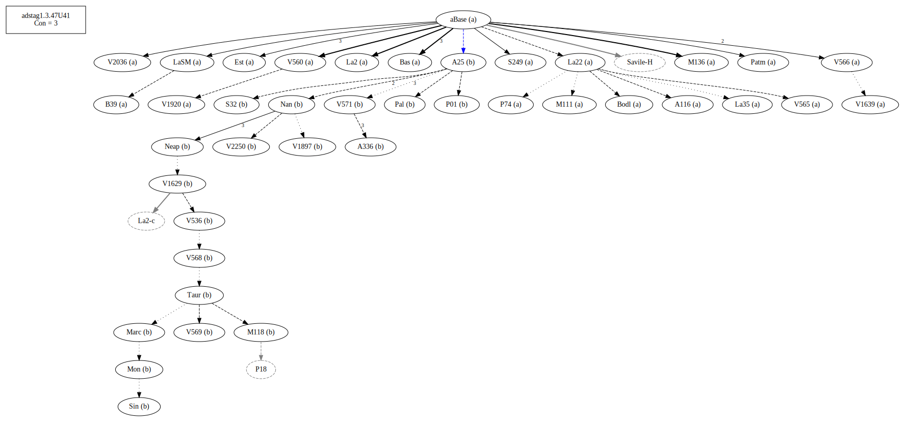
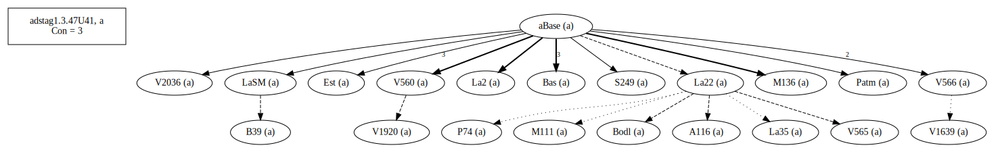
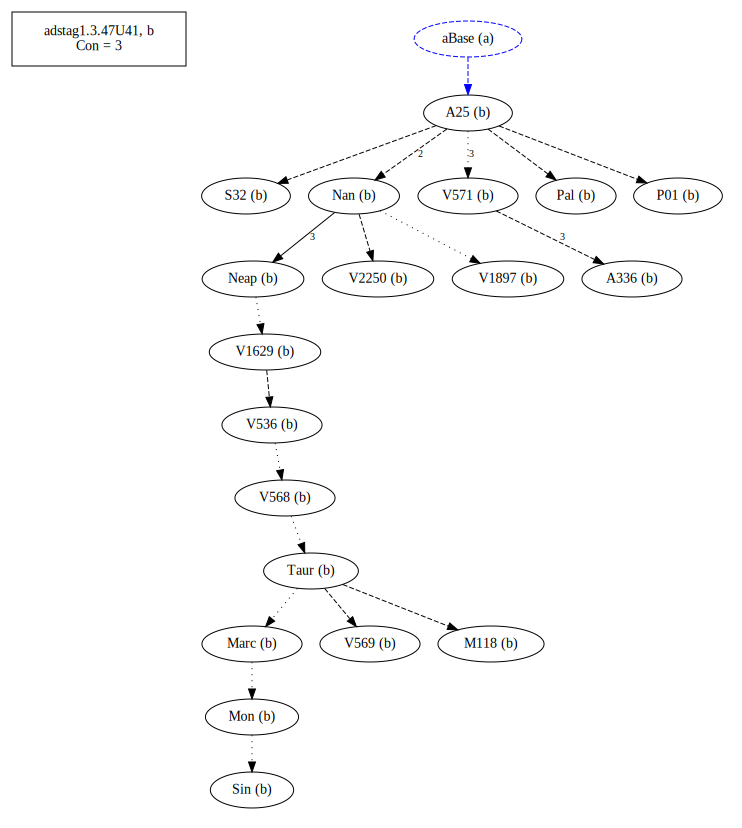
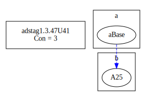
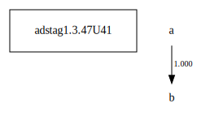

# Variant Analysis: AdStag1.3.47/41

Definite article: τὸν

## 📌 Variant Description
- **Location**: adstag1.3.47/41
- **Variant Units**: 
  - Reading A: καὶ μετὰ φόνον ἔμεινεν ἀτιμώρητος (omit)
  - Reading B: καὶ μετὰ τὸν φόνον ἔμεινεν ἀτιμώρητος

## 🧬 Manuscript Support
| Reading | Manuscripts | Notes |
|--------|-------------|-------|
| A      | A116 B39 Bas Bodl Est La2 La22 La35 LaSM M111 M136 P74 Patm S249 V1639 V1920 V2036 V560 V565 V566| Bas La22 V560 coherence 83.18|
| B      | A25 A336 M118 Marc Mon Nan Neap P01 Pal S32 Sin Taur V1629 V1897 V2250 V536 V568 V569 V571 | A25 not La22, editions coherence 79.27 |

## 🧠 Internal Evidence
- **Transcriptional Probability**: [e.g., Reading A is shorter and more difficult]
- **Stylistic/Contextual Fit**: [e.g., Reading B aligns with second sophistic style]

## 🧭 External Evidence
- **Manuscript Age**: [e.g., Reading A supported by earlier MSS]
- **Geographical Spread**: []

## 🔄 Directionality & Genealogy
- **Likely Original Reading**: [e.g., Reading A]
- **Genealogical Relationships**:
  - [e.g., B likely derived from A via harmonization]
  - [e.g., C appears to be a conflation of A and B]
## open-cbgm textual flow ##

## open-cbgm attestations ##

## open-cbgm flow limited to variant readings ##

## Local stemma ##

- **Contamination Notes**: [e.g., Manuscript F shows mixture of A and B]

## 📝 Notes & Decisions
- Witnesses in B have a higher coherence

---