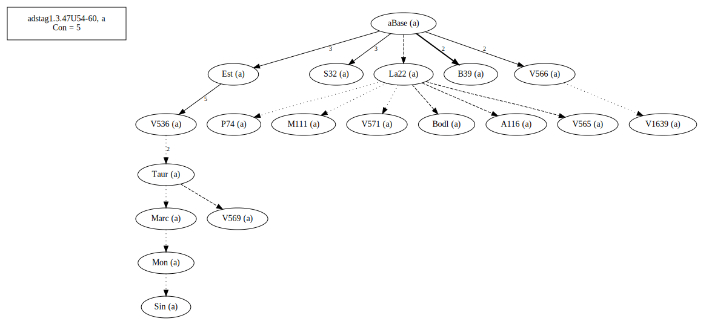
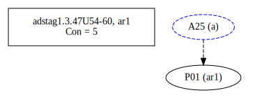
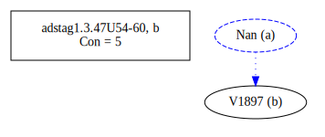
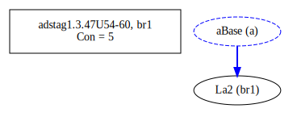
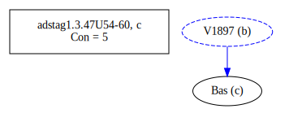
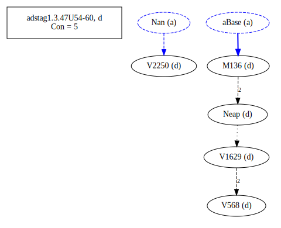
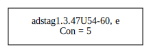
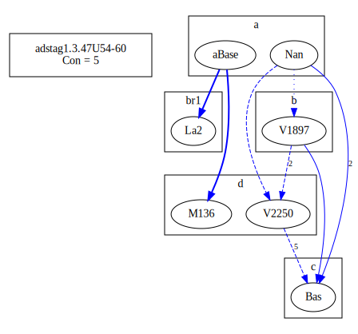
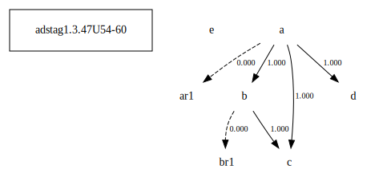

# Variant Analysis: AdStag1.3.47/54-60

## 📌 Variant Description
- **Location**: adstag1.3.47/54-60
- **Variant Units**: 
  - Reading A: μεῖζον ἂν προῆλθε δεινόν
  - Reading Ar1: μεῖζον ἂν προῆλ δεινόν
  - Reading Β: ἂν προῆλθε μεῖζον δεινόν
  - Reading Br1: ἂν προῆλθεν μῖζον δεινόν
  - Reading C: μεῖζον ἂν προῆλθε κακόν
  - Reading D: ἂν μεῖζον προῆλθε κακόν
  - Reading e: ἂν προῆλθε μεῖζον κακόν
## 🧬 Manuscript Support
| Reading | Manuscripts | Notes |
|--------|-------------|-------|
| A      | P74 Pal A25 La35 LaSM Patm S249 V1639 M118 V565 V560 S32 Sin A336 A116 V1920 V2036 Nan M111 V566 V536 Bodl V571 Mon V569 B39 Est Marc Taur La22 | Savile |
| Ar1 |P01 ||
| B      | V1897 |  |
| Br1 |La2 ||
| C      | Bas |  |
| D      | V2250 M136 Neap V568 V1629       |  |
| E      |  | only Migne |

Bas is alone, but 54-58 is in common with B, while 60 agrees with more than B and E.

Not sure, of course, but this is a start and forces me to come back to it.

## 🧠 Internal Evidence
- **Transcriptional Probability**: [e.g., Reading A is shorter and more difficult]
- **Stylistic/Contextual Fit**: [e.g., Reading B aligns with second sophistic style]

## 🧭 External Evidence
- **Manuscript Age**: [e.g., Reading A supported by earlier MSS]
- **Geographical Spread**: []

## 🔄 Directionality & Genealogy
- **Likely Original Reading**: [e.g., Reading A]
- **Genealogical Relationships**:
  - [e.g., B likely derived from A via harmonization]
  - [e.g., C appears to be a conflation of A and B]
## open-cbgm textual flow ##

## open-cbgm attestations ##
   

   

   
   
   
## open-cbgm flow limited to variant readings ##

## Local stemma ##

- **Contamination Notes**: [e.g., Manuscript F shows mixture of A and B]

## 📝 Notes & Decisions
- [Any additional observations, uncertainties, or decisions made]

---