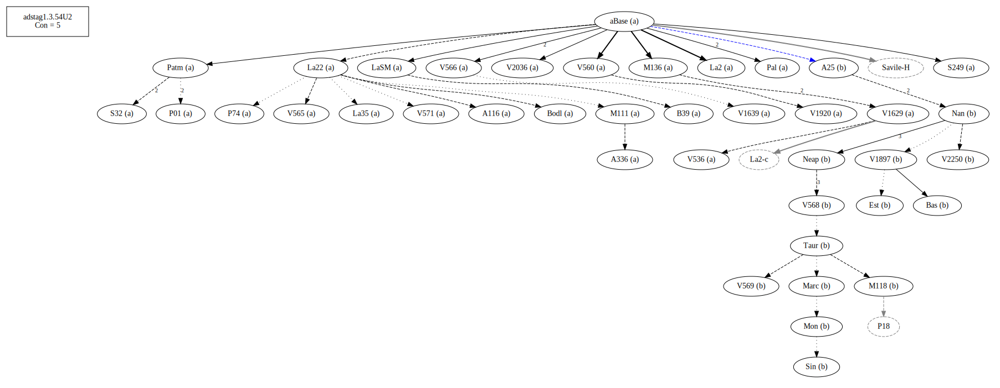
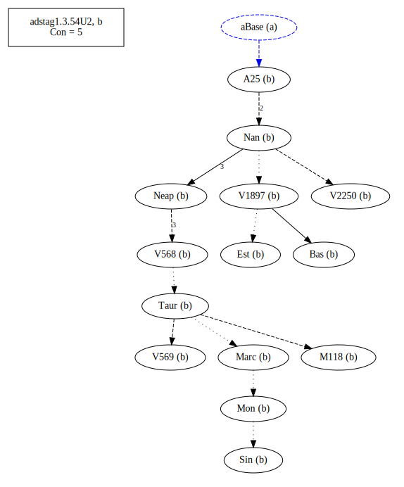
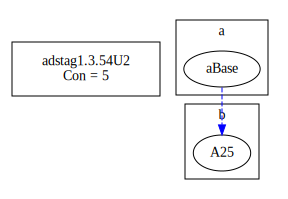
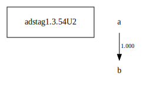

# Variant Analysis: AdStag1.3.54/2

## 📌 Variant Description
- **Location**: adstag1.3.54/2
- **Variant Units**: 
- Reading A: ὅρα
- Reading B: ὅτε

ὅτε γὰρ προσήνεγκε κακῶς ἤλγησεν ὅτι ὑβρίσας οὐκ ἐτιμήθη παρὰ τοῦ ὑβρισθέντος Θεοῦ  

## 🧬 Manuscript Support
| Reading | Manuscripts | Notes |
|--------|-------------|-------|
| A      | A116 A336 B39 Bodl La2 La22 La35 LaSM M111 M136 P01 P74 Pal Patm S249 S32 V1629 V1639 V1920 V2036 V536 V560 V565 V566 V571| More older mss, coherence 87.14 |
| B      | A25 Bas Est M118 Marc Mon Nan Neap Sin Taur V1897 V2250 V568 V569 | A25 Bas, editions, coherence 78.1 |

## 🧠 Internal Evidence
- **Transcriptional Probability**: [e.g., Reading A is shorter and more difficult]
- **Stylistic/Contextual Fit**: [e.g., Reading B aligns with second sophistic style]

## 🧭 External Evidence
- **Manuscript Age**: [e.g., Reading A supported by earlier MSS]
- **Geographical Spread**: []

## 🔄 Directionality & Genealogy
- **Likely Original Reading**: [e.g., Reading A]
- **Genealogical Relationships**:
  - [e.g., B likely derived from A via harmonization]
  - [e.g., C appears to be a conflation of A and B]
## open-cbgm textual flow ##

## open-cbgm attestations ##

## open-cbgm flow limited to variant readings ##

## Local stemma ##

- **Contamination Notes**: [e.g., Manuscript F shows mixture of A and B]

## 📝 Notes & Decisions
- Provisionally, based on more older mss and higher coherence among the witnesses, I am proposing B as the initial text.

---