# Variant Analysis: AdStag1.3.55/4-16

## 📌 Variant Description
- **Variant unit**: adstag1.3.55/4-16

- **Variant Units**: 
  - Reading A: γὰρ φύλαξ εἰμὶ τοῦ ἀδελφοῦ μου φησί 
  - Reading B: γὰρ φύλαξ εἰμὶ τοῦ ἀδελφοῦ μου ἐγώ φησί 
  - Reading C: φύλαξ γὰρ ἐγώ εἰμὶ τοῦ ἀδελφοῦ μου φησί
  - Reading D: φύλαξ γὰρ εἰμὶ τοῦ ἀδελφοῦ μου φησί 
  - Reading E: γὰρ φύλαξ εἰμὶ τοῦ ἀδελφοῦ μου ἐγώ 
  - Reading F: γὰρ φύλαξ εἰμὶ φησι τοῦ ἀδελφοῦ μου ἐγώ
  - Reading G: φύλαξ ἐγώ εἰμὶ τοῦ ἀδελφοῦ μου φησί 
  - Reading H: γὰρ φύλαξ ἐγώ εἰμὶ τοῦ ἀδελφοῦ μου φησί
  - Reading I: γὰρ φύλαξ τοῦ ἐγώ εἰμὶ τοῦ ἀδελφοῦ μου φησί

## 🧬 Manuscript Support
| Reading | Manuscripts | Notes |
|--------|-------------|-------|
| A      | P74. V2250. A25. La35. Patm. S249. V1639. P01. V565. S32. M136. Neap. A336. A116. V2036. M111. V566. V568. aBase. Bodl. V571. V1629. La22. | Migne  |
| B      | LaSM B39 |  |
| C      | Bas |  |
| D | La2 V560 V1920 ||
| E | Pal ||
| F | | Savile |
| G | V1897 ||
| H | M118 Sin Nan V536 Mon Est Marc Taur V1897-c||
| I | V569 ||

## 🧠 Internal Evidence
- **Transcriptional Probability**: [e.g., Reading A is shorter and more difficult]
- **Stylistic/Contextual Fit**: [e.g., Reading B aligns with second sophistic style]

## 🧭 External Evidence
- **Manuscript Age**: [e.g., Reading A supported by earlier MSS]
- **Geographical Spread**: []

## 🔄 Directionality & Genealogy
- **Likely Original Reading**: [e.g., Reading A]
  - [e.g., B likely derived from A via harmonization]
  - [e.g., C appears to be a conflation of A and B]
## open-cbgm textual flow ##
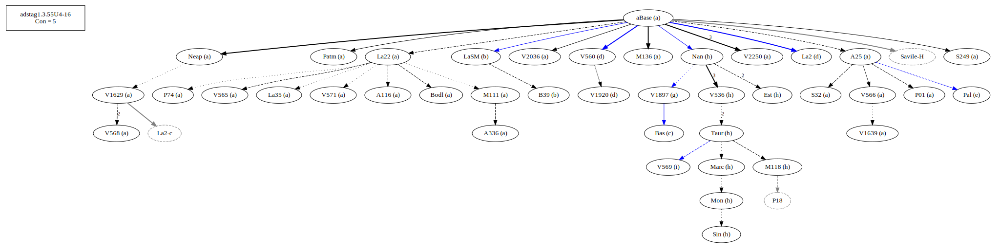
## open-cbgm attestations ##
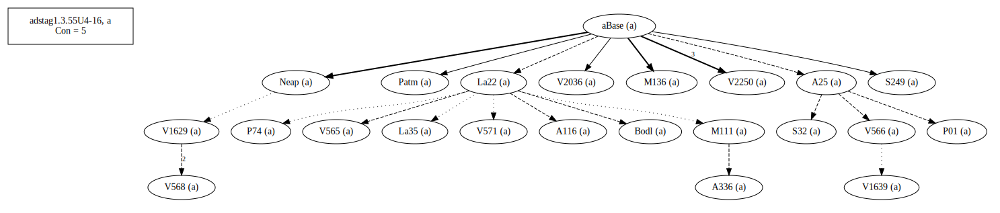      
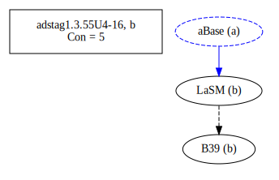      
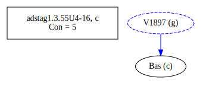      
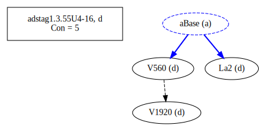      
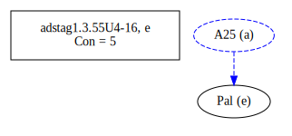      
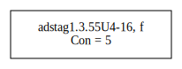      
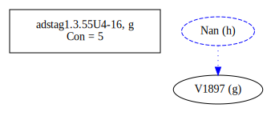      
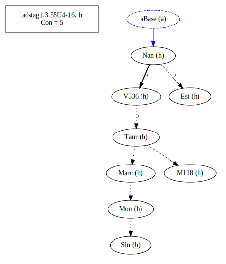      
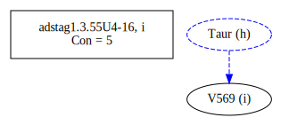      
## open-cbgm flow limited to variant readings ##
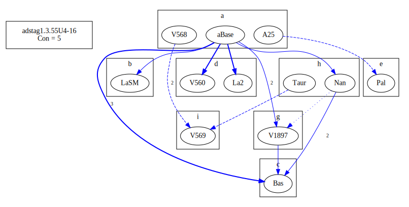
## Local stemma ##
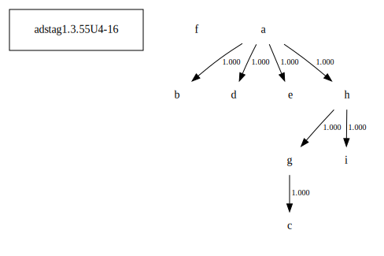

- **Contamination Notes**: [e.g., Manuscript F shows mixture of A and B]

## 📝 Notes & Decisions
- [Any additional observations, uncertainties, or decisions made]

---