# Variant Analysis: AdStag1.3.59/74

A wild range of forms for καθίστημι

I am going to go with Bas and see where things land.

## 📌 Variant Description
- **Location**: adstag1.3.59/74
- **Variant Units**: 
  - Reading A: καθίστη - imperf. causal
  - Reading B: κατέστησε - aor. I causal
  - Reading C: καθίστει - cf C
  - Reading D: κατίστη
  - Reading E: κατέστη - aor. II intrans.
  - Reading F: κατίστει
  - Reading G: καθίστησι - pres. causal
  - Reading H: καθίστητο - 
  - Reading I: omit
  

  

## 🧬 Manuscript Support
| Reading | Manuscripts | Notes |
|--------|-------------|-------|
| A      |  P74 Pal A25 La2 Patm V566 V571 B39 La22|  |
| B      | V1897 V2250 SaSM M118 V565 Sin A116 Nan V568 V536 Mon V569 Est Marc Taur||
| C      | V560 V1920 ||
| D | La35 S249 V1639 V2036 ||
| E | Bas ||
| F | P01 M111 | |
| G | S32 Neap Bodl V1629 | |
| H | A336 |  |
| I | M136 ||

## 🧠 Internal Evidence
- **Transcriptional Probability**: [e.g., Reading A is shorter and more difficult]
- **Stylistic/Contextual Fit**: [e.g., Reading B aligns with second sophistic style]

## 🧭 External Evidence
- **Manuscript Age**: [e.g., Reading A supported by earlier MSS]
- **Geographical Spread**: []

## 🔄 Directionality & Genealogy
- **Likely Original Reading**: [e.g., Reading A]
- **Genealogical Relationships**:
  - [e.g., B likely derived from A via harmonization]
  - [e.g., C appears to be a conflation of A and B]
## open-cbgm textual flow ##
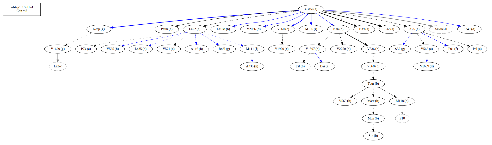
## open-cbgm attestations ##
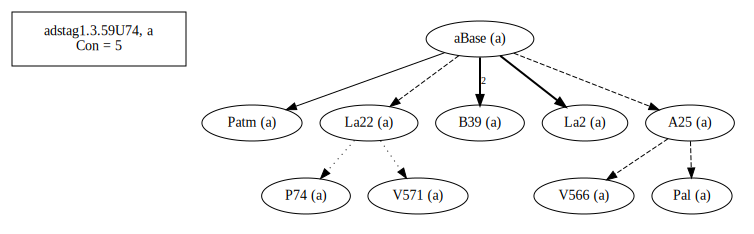
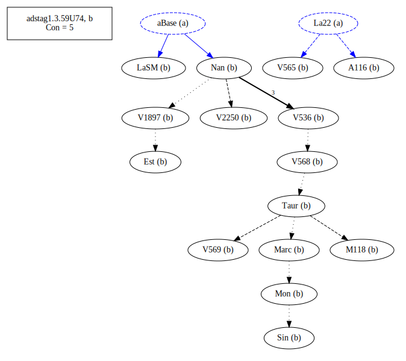
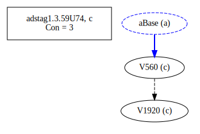
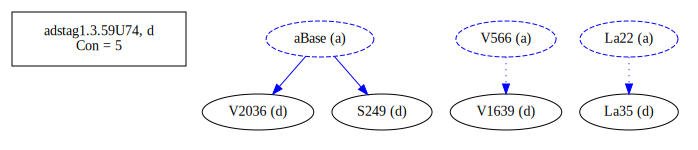
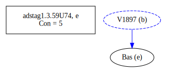
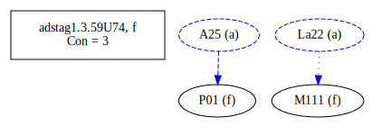
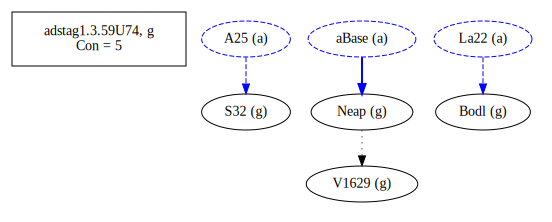
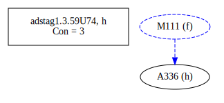
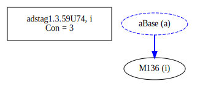
## open-cbgm flow limited to variant readings ##

## Local stemma ##
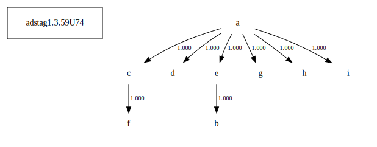

- **Contamination Notes**: [e.g., Manuscript F shows mixture of A and B]

## 📝 Notes & Decisions
- Depends on whether one takes τὸ γεγονός as subject (intransitive) or object (transitive). I am debating between B and C. Intransive is difficult because of the nom. sg. in the participles that go before. That would leave τὸ γεγονός hanging. I am going with C because of A25, La22, La2, older and more consistent than B. Though the aorist feels like a better choice from the context.

---