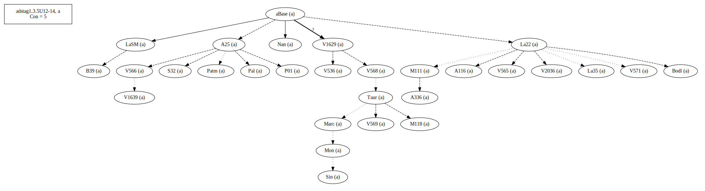
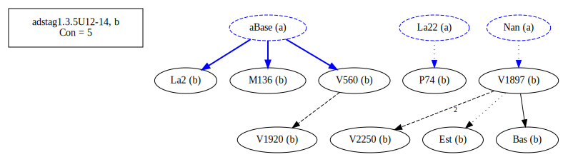

# Variant Analysis: [Passage Reference]

## 📌 Variant Description
- **Location**: AdStag1.3.5/12-14
- **Variant Units**: 
  - Reading A: ἐνόμισεν ἂν
  - Reading B: ἂν ἐνόμισεν
  - Reading C: ἐνόμισεν

## 🧬 Manuscript Support
| Reading | Manuscripts | Notes |
|--------|-------------|-------|
| A      | Bas, Est, La2 M136 P74 V1897 V1920 V2250 V560 | Bas, La2 V560 old |
| B      | A116 A25 A336 B39 Bodl La22 La35 LaSM M111 M118 Marc Mon Nan P01 Pal Patm S32 Sin Taur V1629 V1639 V2036 V536 V565 V566 V568 V569 V571    | Most, editions |
| C      | Neap       | lone |

## 🧠 Internal Evidence
- **Transcriptional Probability**: 
- **Stylistic/Contextual Fit**: 

## 🧭 External Evidence
- **Manuscript Age**: Earliest mss are split
- **Geographical Spread**: []

## 🔄 Directionality & Genealogy
- **Likely Original Reading**: [e.g., Reading A]
- **Genealogical Relationships**:
## open-cbgm textual flow ##

## open-cbgm attestations ##

## open-cbgm flow limited to variant readings ##

## Local stemma ##

- **Contamination Notes**: [e.g., Manuscript F shows mixture of A and B]

## 📝 Notes & Decisions
- Unsure choice. Work with textual flows. Bas and V1897 are usually closer to Nan and the Taur-group. B could be correct afterall.

---