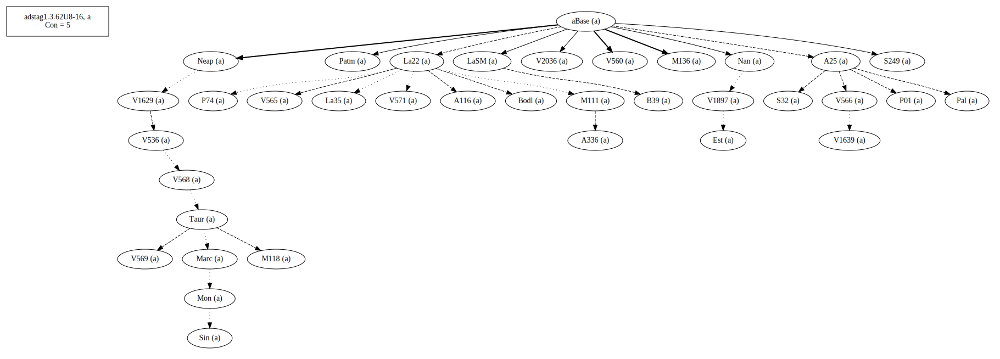
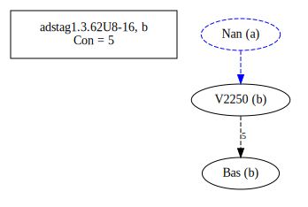
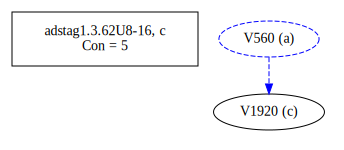
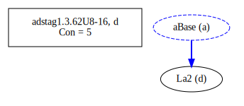
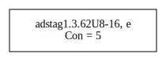
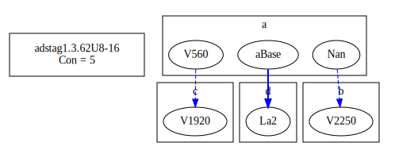
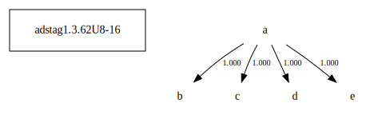

# Variant Analysis: AdStag1.3.62/8-16

Word order. Justify choice if Bas is not chosen. Placement of αὐτὴν

## 📌 Variant Description
- **Location**: adstag1.3.62/8-16
- **Variant Units**: 
  - Reading A: τὴν τιμωρίαν αὐτήν τις ἐξετάσειε
  - Reading B: τὴν τιμωρίαν τις ἐξετάσειεν αὐτήν
  - Reading C: τὴν τιμωρίαν τις ἐξετάσειε
  - Reading D: τὴν τιμωρίαν τις αὐτήν ἐξετάσειε
  - Reading E: τὴν αὐτήν τιμωρίαν τις ἐξετάσειε 

## 🧬 Manuscript Support
| Reading | Manuscripts | Notes |
|--------|-------------|-------|
| A      | A116 A25 A336 B39 Bodl Est La22 La35 LaSM M111 M118 M136 Marc Mon Nan Neap P01 P74 Pal Patm S249 S32 Sin Taur V1629 V1639 V1897 V2036 V536 V560 V565 V566 V568 V569 V571| Most, most oldest, editions |
| B      | V2250 Bas|  |
| C      | V1920 | |
| D      | La2 | lone, old |
| E      | V1920-c | [lone] |

## 🧠 Internal Evidence
- **Transcriptional Probability**: [e.g., Reading A is shorter and more difficult]
- **Stylistic/Contextual Fit**: [e.g., Reading B aligns with second sophistic style]

## 🧭 External Evidence
- **Manuscript Age**: [e.g., Reading A supported by earlier MSS]
- **Geographical Spread**: []

## 🔄 Directionality & Genealogy
- **Likely Original Reading**: [e.g., Reading A]
- **Genealogical Relationships**:
  - [e.g., B likely derived from A via harmonization]
  - [e.g., C appears to be a conflation of A and B]
## open-cbgm textual flow ##

## open-cbgm attestations ##
      
      
      
      
      
## open-cbgm flow limited to variant readings ##

## Local stemma ##

- **Contamination Notes**: [e.g., Manuscript F shows mixture of A and B]

## 📝 Notes & Decisions
- Bas deserves closer attention and a study of word order in Chrysostom. He tends to split up units.

---