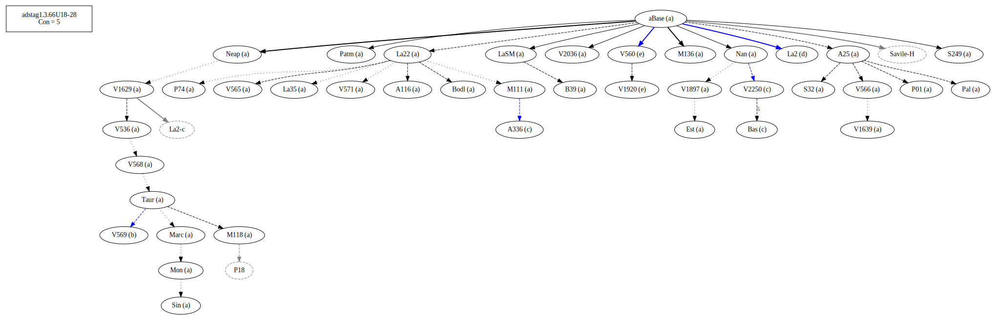
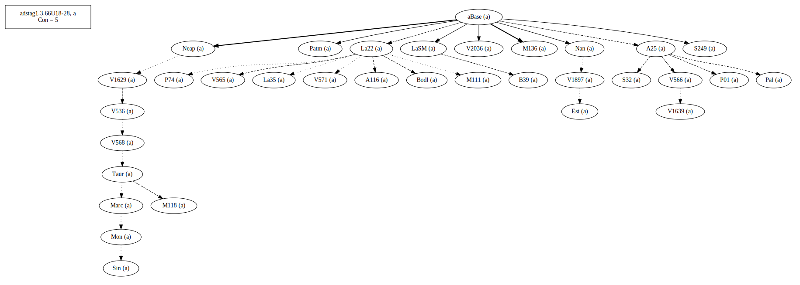
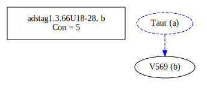
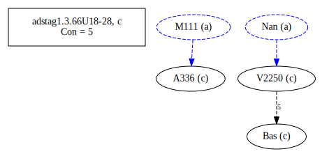
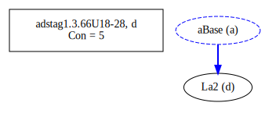
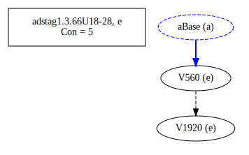
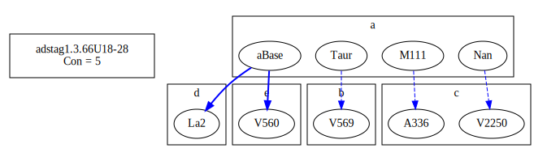
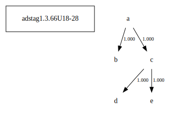

# Variant Analysis: AdStag1.3.66/18-28

## 📌 Variant Description
- **Location**: adstag1.3.66/18-28
- **Variant Units**: 
  - Reading A: παρὰ τοῦ θεοῦ λυπηρὰ ἢ κολαστήρια 
  - Reading B: παρὰ τοῦ θεοῦ λυπηρὰ κολαστήρια 
  - Reading C: παρὰ τοῦ θεοῦ κολαστήρια
  - Reading D: παρὰ θεοῦ κολαστήρια
  - Reading E: κολαστήρια παρὰ τοῦ θεοῦ

## 🧬 Manuscript Support
| Reading | Manuscripts | Notes |
|--------|-------------|-------|
| A      | click to edit 	P74. V1897. Savile. Pal. A25. La35. LaSM. Patm. S249. V1639. M118. P01. V565. S32. M136. Sin. Neap. A116. Base. V2036. Nan. M111. V566. V568. aBase. V536. Bodl. V571. Mon. V1629. B39. Est. Marc. Taur. La22. |  |
| B      | V569   | lone |
| C      | V2250 Bas A336 | |
| D      | La2 | |
| E      | V560 V1920 |  |

## 🧠 Internal Evidence
- **Transcriptional Probability**: [e.g., Reading A is shorter and more difficult]
- **Stylistic/Contextual Fit**: [e.g., Reading B aligns with second sophistic style]

## 🧭 External Evidence
- **Manuscript Age**: [e.g., Reading A supported by earlier MSS]
- **Geographical Spread**: []

## 🔄 Directionality & Genealogy
- **Likely Original Reading**: [e.g., Reading A]
- **Genealogical Relationships**:
## open-cbgm textual flow ##

## open-cbgm attestations ##
   
   
   
   
   
## open-cbgm flow limited to variant readings ##

## Local stemma ##

- **Contamination Notes**: [e.g., Manuscript F shows mixture of A and B]

## 📝 Notes & Decisions
- Because of the high coherence of the largest group, I went with it.

---